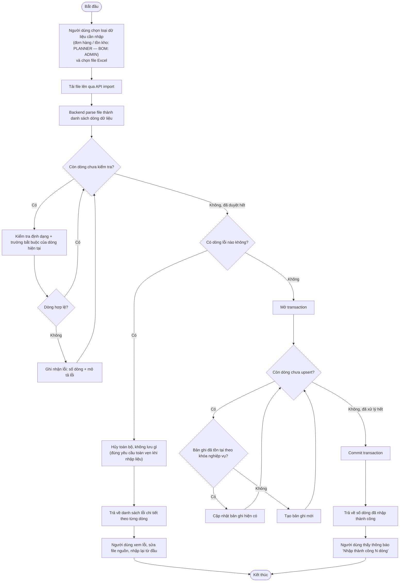
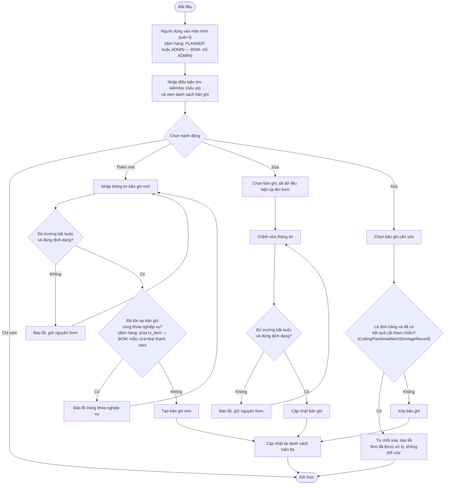
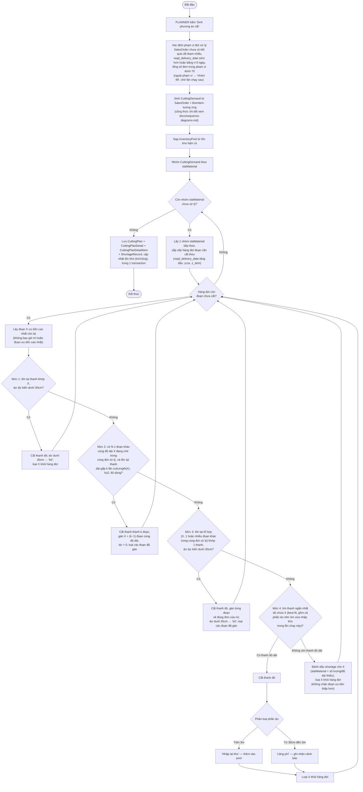

# 3.5 Activity diagram các luồng nghiệp vụ chính

Các sơ đồ dưới đây bổ sung góc nhìn **luồng hoạt động và quyết định** (thứ tự bước, rẽ nhánh, vòng lặp) cho từng luồng nghiệp vụ chính, khác với góc nhìn **tương tác giữa các lớp** đã thể hiện ở `docs/sequence-diagrams.md`. Hai loại sơ đồ mô tả cùng một luồng nghiệp vụ nhưng phục vụ hai mục đích đọc khác nhau: activity diagram cho biết *hệ thống ra quyết định như thế nào ở mỗi bước*, sequence diagram cho biết *thành phần nào gọi thành phần nào*.

## 1. Luồng nhập dữ liệu từ Excel

Áp dụng chung cho cả 3 loại dữ liệu (đơn hàng, tồn kho thanh nan, định mức BOM) — khóa nghiệp vụ dùng để upsert khác nhau theo loại dữ liệu (đơn hàng: `ycsx`+`z_item`; tồn kho: `slatMaterial`+`doDaiThanhMm`; BOM: `doorProduct`+`slatMaterial`), nhưng luồng xử lý và quy tắc toàn vẹn giao dịch (tất cả-hoặc-không-gì) là như nhau. Actor thực hiện khác nhau theo loại dữ liệu: PLANNER nhập đơn hàng/tồn kho, còn định mức BOM thuộc trách nhiệm của ADMIN (dữ liệu nền tảng, ảnh hưởng trực tiếp đến độ chính xác toàn hệ thống).

Điểm cần lưu ý: hai vòng lặp (kiểm tra định dạng và upsert) được tách rời — chỉ bước sang giai đoạn upsert khi **toàn bộ** các dòng đã qua kiểm tra định dạng, tránh trường hợp nhập được một phần rồi mới phát hiện lỗi ở dòng sau.

Riêng luồng nhập tồn kho có thêm một hành vi không thể hiện ở sơ đồ trên để giữ sơ đồ chung đơn giản: nếu một tổ hợp (loại thanh, độ dài) từng tồn tại trong hệ thống nhưng không còn xuất hiện trong file mới nhập, hệ thống chủ động đưa số thanh còn lại về 0 thay vì giữ nguyên giá trị cũ — khác với hành vi upsert thuần túy (chỉ thêm/sửa, không xóa/reset) áp dụng cho đơn hàng và BOM.

## 2. Luồng quản lý đơn hàng & BOM

Áp dụng chung cho luồng quản lý đơn hàng (PLANNER và ADMIN đều thao tác được) và luồng quản lý định mức BOM (chỉ ADMIN) — cùng là thao tác CRUD cơ bản (xem/tìm-lọc, thêm mới, sửa, xóa) trên dữ liệu thường đã có sẵn trong hệ thống từ luồng nhập Excel ở mục 1, nhưng khác nhau ở tác nhân thực hiện, khóa nghiệp vụ dùng để kiểm tra trùng lặp khi thêm mới, và điều kiện lọc danh sách: đơn hàng lọc theo ngày giao yêu cầu, khách hàng hoặc trạng thái xử lý (trạng thái này không phải cột lưu sẵn mà suy ra từ việc đơn đã có kết quả cắt/thiếu vật tư tham chiếu hay chưa — xem `docs/domain-model.md` mục 3.3.1); BOM lọc theo mẫu cửa hoặc nhóm thanh nan.

Điểm cần lưu ý: nhánh xóa có rẽ nhánh riêng cho đơn hàng — một khi đơn hàng đã được đưa vào ít nhất một lần chạy thuật toán (có `CuttingPlanDetailItem` hoặc `ShortageRecord` tham chiếu tới, xem `docs/domain-model.md` mục 3.3.1), hệ thống từ chối xóa thay vì để phát sinh lỗi ràng buộc khóa ngoại ở tầng cơ sở dữ liệu. BOM không có bảng con nào tham chiếu trực tiếp đến `BomItem` nên nhánh này luôn cho phép xóa bình thường. Luồng quản lý tồn kho thanh nan không nằm trong sơ đồ này — tồn kho được nhập/cập nhật chủ yếu qua luồng Excel ở mục 1 (bao gồm cả chỉnh sửa thủ công theo cùng khóa nghiệp vụ loại thanh + độ dài), không có luồng CRUD tách rời riêng.

## 3. Luồng thuật toán sinh phương án cắt (luồng lõi)

Đây là luồng nghiệp vụ quan trọng nhất của khóa luận — thuật toán Best Fit Decreasing mở rộng 4 mức ưu tiên. Sơ đồ dưới đây bổ sung góc nhìn ra quyết định cho luồng đã có ở `docs/sequence-diagrams.md` mục "2. Luồng sinh phương án cắt" (thể hiện thành phần nào gọi thành phần nào); công thức chi tiết sinh `CuttingDemand` từ `SalesOrder`+`BomItem` cũng đã trình bày đầy đủ ở đó, không lặp lại ở đây.

Điểm dễ hiểu nhầm nhất, cần nhấn lại: thứ tự **xử lý** trong hàng đợi luôn theo đúng ưu tiên `(reqd_delivery_date, ycsx, z_item)` — đoạn X ở bước "Lấy đoạn X ưu tiên cao nhất còn lại" luôn là đoạn đầu hàng đợi, không bao giờ bị bỏ qua để chờ ghép; khác với phạm vi **ghép nối** ở Mức 2 và Mức 3, chỉ áp dụng giữa các đoạn cùng nằm trong đợt xử lý hiện tại (đã giới hạn bởi bước "Xác định phạm vi đợt xử lý" ở đầu sơ đồ), không bao giờ ghép với đơn thuộc "nhóm 99" hay đợt xử lý sau. Ngoài ra, mỗi nhóm `slatMaterial` ở vòng lặp ngoài được xử lý độc lập với nhau — vì tồn kho (`InventoryBatch`) đã tách riêng theo `slatMaterial`, không có ràng buộc chéo giữa các nhóm.
