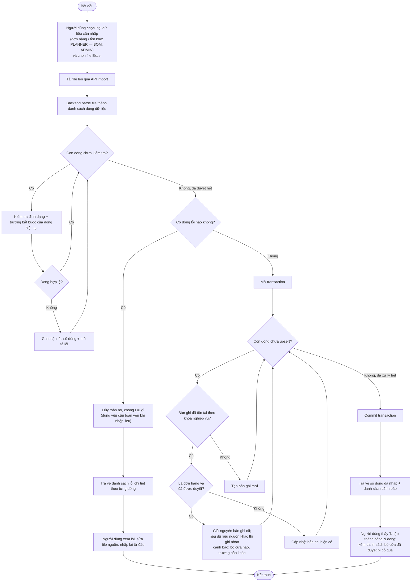
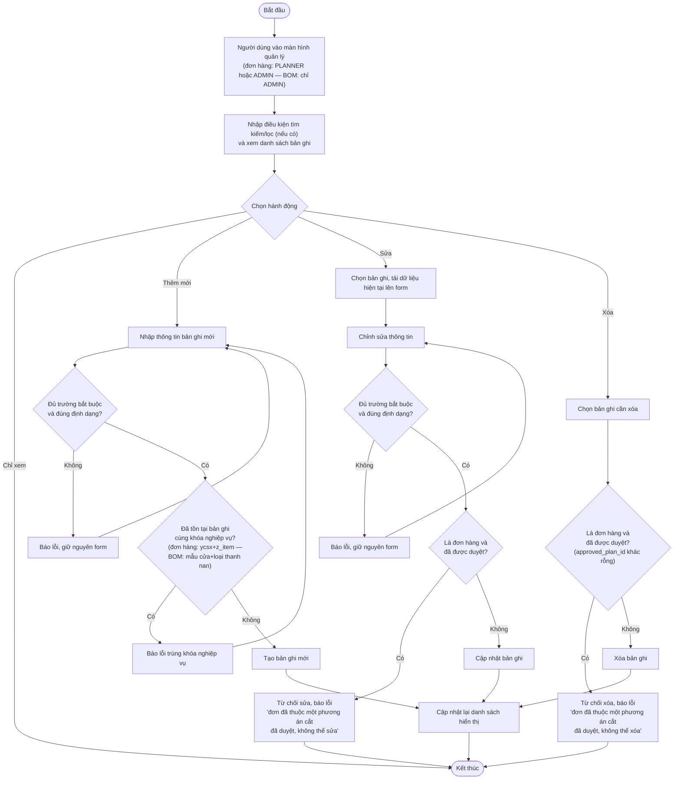
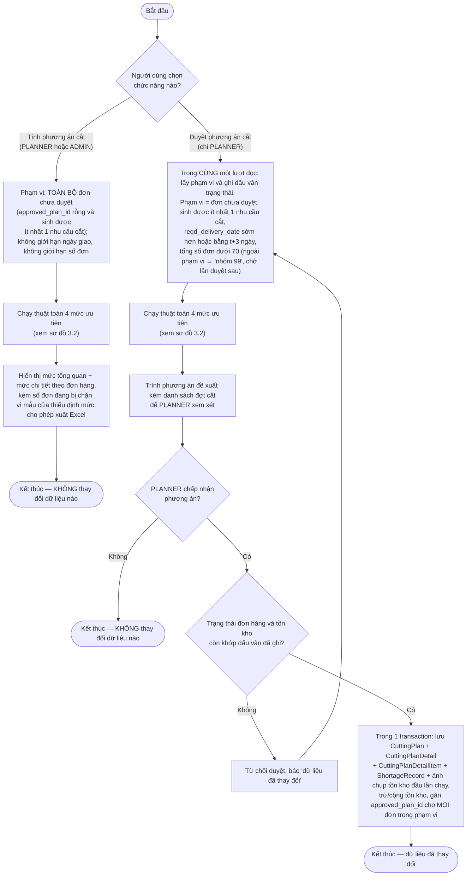
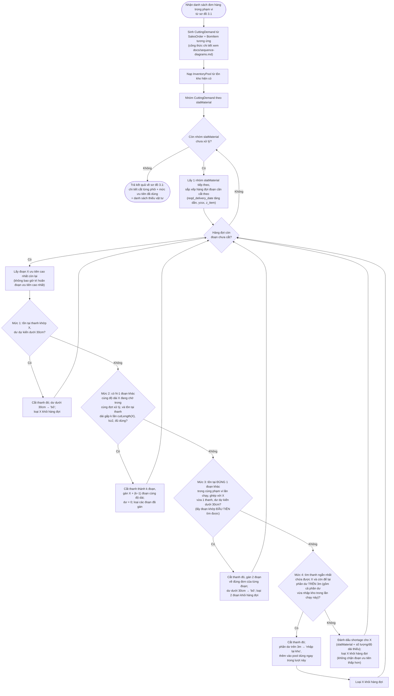
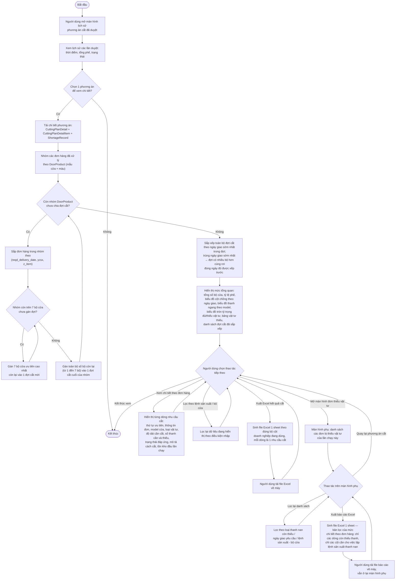

# 3.5 Activity diagram các luồng nghiệp vụ chính

Các sơ đồ dưới đây bổ sung góc nhìn **luồng hoạt động và quyết định** (thứ tự bước, rẽ nhánh, vòng lặp) cho từng luồng nghiệp vụ chính, khác với góc nhìn **tương tác giữa các lớp** đã thể hiện ở `docs/sequence-diagrams.md`. Hai loại sơ đồ mô tả cùng một luồng nghiệp vụ nhưng phục vụ hai mục đích đọc khác nhau: activity diagram cho biết *hệ thống ra quyết định như thế nào ở mỗi bước*, sequence diagram cho biết *thành phần nào gọi thành phần nào*.

## 1. Luồng nhập dữ liệu từ Excel

Áp dụng chung cho cả 3 loại dữ liệu (đơn hàng, tồn kho thanh nan, định mức BOM) — khóa nghiệp vụ dùng để upsert khác nhau theo loại dữ liệu (đơn hàng: `ycsx`+`z_item`; tồn kho: `slatMaterial`+`doDaiThanhMm`; BOM: `doorProduct`+`slatMaterial`), nhưng luồng xử lý và quy tắc toàn vẹn giao dịch (tất cả-hoặc-không-gì) là như nhau. Actor thực hiện khác nhau theo loại dữ liệu: PLANNER nhập đơn hàng/tồn kho, còn định mức BOM thuộc trách nhiệm của ADMIN (dữ liệu nền tảng, ảnh hưởng trực tiếp đến độ chính xác toàn hệ thống).

Nhánh "đã được duyệt" ở vòng lặp upsert là ranh giới bất biến của đơn hàng đã chốt: nan của bộ cửa đó đã cắt theo kích thước đã lưu, ghi đè chỉ làm hồ sơ lệch với vật tư đã ra khỏi kho mà không khiến bộ cửa được cắt lại. Cảnh báo **không** hủy lượt nhập — khác hẳn nhánh lỗi định dạng ở trên: dòng lỗi định dạng nghĩa là file nguồn sai và phải sửa rồi nhập lại, còn ở đây file nguồn không sai, chỉ là hệ thống không được phép tự ý áp thay đổi lên một việc đã làm xong; quyết định tạo bộ cửa mới để cắt lại thuộc về PLANNER.

Điểm cần lưu ý: hai vòng lặp (kiểm tra định dạng và upsert) được tách rời — chỉ bước sang giai đoạn upsert khi **toàn bộ** các dòng đã qua kiểm tra định dạng, tránh trường hợp nhập được một phần rồi mới phát hiện lỗi ở dòng sau.

Riêng luồng nhập tồn kho có thêm một hành vi không thể hiện ở sơ đồ trên để giữ sơ đồ chung đơn giản: nếu một tổ hợp (loại thanh, độ dài) từng tồn tại trong hệ thống nhưng không còn xuất hiện trong file mới nhập, hệ thống chủ động đưa số thanh còn lại về 0 thay vì giữ nguyên giá trị cũ — khác với hành vi upsert thuần túy (chỉ thêm/sửa, không xóa/reset) áp dụng cho đơn hàng và BOM.

## 2. Luồng quản lý đơn hàng & BOM

Áp dụng chung cho luồng quản lý đơn hàng (PLANNER và ADMIN đều thao tác được) và luồng quản lý định mức BOM (chỉ ADMIN) — cùng là thao tác CRUD cơ bản (xem/tìm-lọc, thêm mới, sửa, xóa) trên dữ liệu thường đã có sẵn trong hệ thống từ luồng nhập Excel ở mục 1, nhưng khác nhau ở tác nhân thực hiện, khóa nghiệp vụ dùng để kiểm tra trùng lặp khi thêm mới, và điều kiện lọc danh sách: đơn hàng lọc theo ngày giao yêu cầu, khách hàng hoặc trạng thái xử lý (bốn giá trị: chưa xử lý / đang bị chặn vì thiếu định mức / đủ vật tư / thiếu vật tư — việc đơn đã duyệt hay chưa đọc thẳng từ `approved_plan_id`, phần còn lại suy ra từ dữ liệu liên quan, xem `docs/domain-model.md` mục 3.3.1); BOM lọc theo mẫu cửa hoặc nhóm thanh nan.

Điểm cần lưu ý: nhánh xóa có rẽ nhánh riêng cho đơn hàng — một khi đơn hàng đã thuộc một phương án cắt được duyệt (`approved_plan_id` khác rỗng, xem `docs/domain-model.md` mục 3.3.1), hệ thống từ chối xóa thay vì để phát sinh lỗi ràng buộc khóa ngoại ở tầng cơ sở dữ liệu. BOM không có bảng con nào tham chiếu trực tiếp đến `BomItem` nên nhánh này luôn cho phép xóa bình thường. Luồng quản lý tồn kho thanh nan không nằm trong sơ đồ này — tồn kho được nhập/cập nhật chủ yếu qua luồng Excel ở mục 1 (bao gồm cả chỉnh sửa thủ công theo cùng khóa nghiệp vụ loại thanh + độ dài), không có luồng CRUD tách rời riêng.

## 3. Luồng tính và duyệt phương án cắt (luồng lõi)

Đây là luồng nghiệp vụ quan trọng nhất của khóa luận. Nó được trình bày thành hai sơ đồ vì hai câu hỏi khác nhau cần trả lời riêng: sơ đồ 3.1 cho biết **đơn hàng nào được đưa vào và tới lúc nào dữ liệu mới thực sự thay đổi** — đây là phần khác nhau giữa chức năng tính và chức năng duyệt; sơ đồ 3.2 cho biết **thuật toán quyết định cắt thanh nào như thế nào** — phần này hai chức năng dùng chung y hệt, chỉ khác tập đơn đưa vào. Gộp cả hai vào một sơ đồ sẽ khiến nhánh quyết định của thuật toán bị lẫn với nhánh quyết định của quy trình phê duyệt, trong khi chúng thuộc hai tầng khác nhau.

Cả hai sơ đồ bổ sung góc nhìn ra quyết định cho luồng đã có ở `docs/sequence-diagrams.md` mục "2. Luồng tính và duyệt phương án cắt" (thể hiện thành phần nào gọi thành phần nào); công thức chi tiết sinh `CuttingDemand` từ `SalesOrder`+`BomItem` cũng đã trình bày đầy đủ ở đó, không lặp lại ở đây.

### 3.1. Phạm vi xử lý và ranh giới thay đổi dữ liệu

Hai điểm quyết định cách đọc sơ đồ này. Thứ nhất, **nhánh tính không có ô nào ghi dữ liệu** — đó là toàn bộ lý do tách chức năng: người dùng chạy thử bao nhiêu lần tùy ý trên trạng thái đang có mà không làm lệch tồn kho, nên mới dám bỏ giới hạn t+3 ngày và giới hạn 70 đơn để nhìn bức tranh thiếu hụt của toàn bộ đơn tồn. Thứ hai, **ô kiểm dấu vân trạng thái trước khi ghi là bắt buộc, không phải tối ưu**: giữa lúc phương án được tính và lúc PLANNER bấm duyệt, một lượt nhập tồn kho hoặc một đơn vừa sửa có thể đã làm phương án lỗi thời; ghi xuống khi đó sẽ trừ tồn kho những phôi thực tế không còn, hoặc bỏ sót đơn vừa được bổ sung vào phạm vi. Dấu vân phải được lấy **trong cùng một lượt đọc** với danh sách đơn trong phạm vi, không phải sau khi thuật toán chạy xong: nếu chụp sau, dữ liệu đổi ngay trong lúc thuật toán chạy sẽ được ghi vào dấu vân như thể không có gì xảy ra, và cơ chế này mất tác dụng đúng ở tình huống nó sinh ra để chặn. Khi dấu vân lệch, luồng quay lại chính bước lấy phạm vi — không quay lại bước trình phương án, vì dấu vân cũ vẫn lệch thì PLANNER sẽ bị từ chối mãi.

Lưu ý ở nhánh duyệt: `approved_plan_id` được gán cho **mọi** đơn trong phạm vi, kể cả đơn chỉ nhận kết quả thiếu vật tư — nếu chỉ gán cho đơn cắt được thì đơn thiếu vật tư sẽ quay lại hàng chờ và bị đưa vào lần duyệt sau, trong khi vật tư bù chưa kịp về. Ngoại lệ duy nhất là lớp phòng vệ cho kẽ hở của điều kiện lọc phạm vi: đơn lọt vào phạm vi nhưng rốt cuộc không để lại kết quả nào thì giữ nguyên ở hàng chờ thay vì đánh dấu đã duyệt (xem `docs/domain-model.md`). Còn đơn có mẫu cửa không sinh được nhu cầu cắt nào thì ngay từ đầu đã nằm ngoài phạm vi của cả hai nhánh (xem điều kiện lọc ở `docs/requirements-functional.md` Nhóm 3), nên không bị đánh dấu đã duyệt một cách oan uổng.

### 3.2. Thuật toán cắt 4 mức ưu tiên

Sơ đồ dưới đây là thuật toán Best Fit Decreasing mở rộng, nhận vào danh sách đơn hàng trong phạm vi đã xác định ở sơ đồ 3.1 và trả về kết quả cắt — giống hệt nhau dù được gọi từ chức năng tính hay chức năng duyệt.

Một hệ quả quan trọng của cách đặt điều kiện ở Mức 4: hệ thống **không bao giờ tự tạo ra phần dư nằm trong khoảng 30cm–3m**. Mức 1 và Mức 3 chỉ nhận thanh khi phần dư dự kiến dưới 30cm, Mức 2 luôn cho phần dư bằng 0, còn Mức 4 chỉ nhận thanh khi phần dư trên 3m — tức là mọi nhánh cắt đều dẫn tới một phần dư hoặc đủ nhỏ để bỏ đi, hoặc đủ dài để nhập lại kho. Khi không nhánh nào thỏa mãn, đoạn cắt được đánh dấu thiếu vật tư thay vì hạ chuẩn để cắt. Điều này có nghĩa một đoạn có thể bị báo thiếu **dù trong kho vẫn còn thanh đủ dài**: nếu thanh đó chỉ để lại phần dư trong khoảng không chấp nhận được, nó được giữ lại nguyên vẹn cho một đoạn khác khớp hơn ở lần chạy sau. Đây là lựa chọn nghiệp vụ có chủ đích — phần dư 30cm–3m không tái sử dụng ngay được mà cũng không đủ nhỏ để bỏ qua, nên doanh nghiệp coi việc bổ sung thanh nan đúng độ dài là cách xử lý đúng, thay vì phá một thanh đang dùng được cho nhu cầu khác.

Mức 3 cố ý chỉ ghép **đúng hai đoạn** và dừng ở đoạn khớp **đầu tiên** tìm được, không tìm tổ hợp ba đoạn trở lên cũng không duyệt hết hàng đợi để chọn tổ hợp tốt nhất: số tổ hợp tăng theo cấp số nhân với số đoạn được phép ghép, trong khi phần lợi thêm rất nhỏ vì điều kiện chấp nhận đã là phần dư dưới 30cm — và giới hạn này giữ cho kết quả tái lập được, không phụ thuộc thứ tự duyệt.

Điểm dễ hiểu nhầm nhất, cần nhấn lại: thứ tự **xử lý** trong hàng đợi luôn theo đúng ưu tiên `(reqd_delivery_date, ycsx, z_item)` — đoạn X ở bước "Lấy đoạn X ưu tiên cao nhất còn lại" luôn là đoạn đầu hàng đợi, không bao giờ bị bỏ qua để chờ ghép; khác với phạm vi **ghép nối** ở Mức 2 và Mức 3, chỉ áp dụng giữa các đoạn cùng nằm trong phạm vi của chính lần chạy đó (đã xác định ở sơ đồ 3.1 — toàn bộ đơn chưa duyệt nếu là chức năng tính, tập đơn đã giới hạn t+3/dưới 70 đơn nếu là chức năng duyệt), không bao giờ ghép với đơn nằm ngoài phạm vi. Ngoài ra, mỗi nhóm `slatMaterial` ở vòng lặp ngoài được xử lý độc lập với nhau — vì tồn kho (`InventoryBatch`) đã tách riêng theo `slatMaterial`, không có ràng buộc chéo giữa các nhóm.

## 4. Luồng xem/xuất kết quả phương án cắt

Luồng này áp dụng cho các phương án **đã được duyệt** và lưu lại — chức năng tính không tạo lịch sử nên không có gì để tra cứu về sau. Sơ đồ dưới đây bổ sung góc nhìn ra quyết định cho luồng đã có ở `docs/sequence-diagrams.md` mục "3. Luồng xem / xuất kết quả phương án cắt" (thể hiện thành phần nào gọi thành phần nào, khá tuyến tính: xem lịch sử → xem chi tiết → hai thao tác xuất Excel tùy chọn). Phần bổ sung giá trị nhất ở đây là cách hệ thống **tính và sắp xếp "đợt cắt"** để hiển thị ở mức tổng quan — quy tắc nghiệp vụ có nhiều rẽ nhánh nhất của luồng này, đã chốt ở `docs/requirements-functional.md` Nhóm 3 nhưng chưa từng thể hiện dưới dạng flowchart quyết định.

Điểm cần lưu ý: "đợt cắt" không phải một entity lưu trữ riêng (xem `docs/domain-model.md` mục "Ghi chú khác") — toàn bộ khối tính đợt cắt (bước D đến K) là kết quả tính **tại thời điểm hiển thị**, không đọc từ cột trạng thái nào. Vì vậy mỗi lần PLANNER mở lại cùng một `CuttingPlan` đã lưu trước đó, thứ tự và nội dung các đợt cắt luôn được suy ra lại từ dữ liệu gốc (`CuttingPlanDetailItem`, `SalesOrder`) chứ không phải đọc một giá trị đã chốt cứng — đảm bảo không bị lệch (stale) nếu logic nhóm đợt cắt thay đổi sau này.
