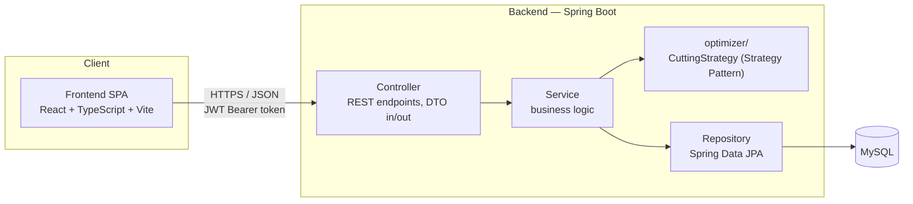

# 3.2 Kiến trúc tổng quan hệ thống

Hệ thống được xây dựng theo mô hình **client-server 3 tầng** kinh điển: một ứng dụng frontend dạng SPA (Single Page Application) giao tiếp với backend qua REST API, backend xử lý toàn bộ nghiệp vụ (bao gồm thuật toán cắt tối ưu) và lưu trữ dữ liệu trong MySQL. Lựa chọn này phù hợp với quy mô một ứng dụng quản trị nội bộ dùng bởi một nhóm nhỏ người dùng (PLANNER, ADMIN), không cần đến kiến trúc microservices hay các cơ chế xử lý phân tán — trọng tâm khóa luận là chất lượng thiết kế và tính đúng đắn của thuật toán cắt, không phải bài toán về quy mô hạ tầng.



## 3.2.1 Kiến trúc phân lớp (backend)

Backend tổ chức theo **kiến trúc phân lớp (layered architecture)** cổ điển, mỗi lớp chỉ phụ thuộc vào lớp ngay dưới nó, đảm bảo tách biệt rõ trách nhiệm và dễ kiểm thử độc lập từng lớp:

- **Controller** — tiếp nhận HTTP request, xác thực đầu vào ở mức hình thức (validation annotation), chuyển đổi qua DTO và gọi Service tương ứng; không chứa logic nghiệp vụ. Đây cũng là nơi áp dụng kiểm soát phân quyền theo vai trò (`@PreAuthorize`) cho từng endpoint.
- **Service** — nơi đặt toàn bộ logic nghiệp vụ: quy tắc import dữ liệu, tính nhu cầu cắt từ BOM, điều phối thuật toán cắt tối ưu cho cả chức năng tính lẫn chức năng duyệt, kiểm tra ràng buộc phân quyền ở mức nghiệp vụ (không chỉ ở tầng Controller). Service không phụ thuộc vào chi tiết HTTP hay chi tiết truy vấn SQL.
- **optimizer** (module con của Service) — cài đặt thuật toán cắt tối ưu qua interface `CuttingStrategy`, tách riêng khỏi phần điều phối nghiệp vụ còn lại của Service để có thể kiểm thử và thay thế độc lập (xem 3.2.2).
- **Repository** — lớp truy cập dữ liệu, dùng Spring Data JPA, không chứa logic nghiệp vụ, chỉ chịu trách nhiệm truy vấn/lưu trữ.
- **Domain** — các entity JPA ánh xạ trực tiếp sang bảng MySQL (xem ERD ở mục 3.3), là nguồn sự thật duy nhất về cấu trúc dữ liệu nghiệp vụ.

Một request đi qua đúng một chiều Controller → Service → (Repository | optimizer) → Domain; không có lớp nào gọi ngược lớp phía trên, giúp luồng dữ liệu dễ theo dõi và mỗi lớp có thể unit test bằng cách mock lớp liền dưới.

## 3.2.2 Strategy Pattern cho thuật toán cắt

Thuật toán cắt tối ưu (BFD mở rộng 4 mức ưu tiên, xem `docs/sequence-diagrams.md` mục "2. Luồng tính và duyệt phương án cắt (luồng lõi)") được đóng gói qua một interface duy nhất:

```java
public interface CuttingStrategy {
    CuttingPlanResult computePlan(List<CuttingDemand> demands, InventoryPool pool);
}
```

Việc tách interface này khỏi phần điều phối nghiệp vụ (`CuttingPlanService` — điều phối luồng: xác định phạm vi đơn hàng, gọi `CuttingDemandService` để sinh `CuttingDemand` từ BOM, gọi `CuttingStrategy` để tính phương án, và riêng ở chức năng duyệt thì lưu `CuttingPlanResult` cùng cập nhật tồn kho, xem chi tiết ở `docs/sequence-diagrams.md`) tuân theo nguyên tắc Open/Closed: thêm một chiến lược cắt khác (ví dụ một cách tiếp cận dựa trên ILP để làm đối chứng ở Chương 4) chỉ cần thêm một lớp cài đặt mới `implements CuttingStrategy`, không cần sửa Controller, Service điều phối hay Repository. Đây cũng là lý do khóa luận không chọn ILP/OR-Tools làm engine chính ngay từ đầu — tránh native dependency nặng trong khi mục tiêu đánh giá là chất lượng kiến trúc, nhưng vẫn giữ đường mở rộng sang benchmark thuật toán khác nếu cần.

Việc tách interface này cũng là thứ giúp tách chức năng **tính** và chức năng **duyệt** phương án cắt mà không phải nhân đôi thuật toán. `computePlan` chỉ nhận vào danh sách nhu cầu cắt và ảnh chụp tồn kho, không biết gì về phạm vi đơn hàng lẫn việc kết quả có được lưu xuống hay không — hai mối quan tâm đó nằm hoàn toàn ở `CuttingPlanService`. Nhờ vậy hai chức năng khác nhau về phạm vi và về tác động dữ liệu vẫn dùng chung đúng một cài đặt thuật toán, và bộ unit test viết cho thuật toán bảo chứng cho cả hai.

## 3.2.3 DTO và Mapper — tách domain khỏi API contract

Controller không bao giờ nhận hoặc trả trực tiếp entity JPA; mọi request/response đi qua DTO riêng, chuyển đổi qua entity bằng MapStruct (sinh code tại compile-time, không dùng reflection runtime). Lý do tách riêng hai mô hình:

- Entity domain phản ánh đúng ràng buộc CSDL (ví dụ quan hệ N-N giữa `CuttingPlanDetail` và `SalesOrder`, mục 3.3), trong khi API contract cần một hình thức đơn giản, ổn định cho frontend — hai mối quan tâm này thay đổi độc lập với nhau.
- Tránh lộ chi tiết nội bộ (ví dụ trường kỹ thuật dùng cho thuật toán) ra ngoài API, và tránh vòng lặp serialize vô hạn khi entity có quan hệ hai chiều.

## 3.2.4 Tổ chức mã nguồn

```
GraduationtThesis/
├── backend/                # Spring Boot 4.1.1 (Java 21 target, build JDK 23), Maven
│   └── src/main/java/com/slatcut/cutting/
│       ├── domain/         # Entity JPA
│       ├── repository/     # Spring Data JPA repositories
│       ├── service/        # Business logic (interfaces + impl)
│       │   └── optimizer/  # Strategy pattern: CuttingStrategy + BestFitDecreasingStrategy
│       ├── controller/     # REST controllers (DTO in/out only)
│       ├── dto/
│       ├── security/       # JWT filter, Spring Security config
│       ├── mapper/         # MapStruct entity<->DTO
│       └── config/
│   └── src/test/java/...   # JUnit5 + Mockito (unit), Testcontainers (integration)
├── frontend/                # React + TypeScript + Vite
│   └── src/
│       ├── features/{auth,sales-orders,inventory,bom,cutting-plans}/
│       ├── components/      # shared UI (Table, CuttingBarChart svg component,...)
│       ├── api/              # axios client + generated types
│       └── app/              # routing, layout
├── docs/                    # tài liệu thiết kế: use case, ERD, sơ đồ luồng nghiệp vụ (chương 3)
├── dataset/                 # data thật, đã .gitignore (dùng để test/import cục bộ)
├── docker-compose.yml        # mysql + backend + frontend, dùng cho demo bảo vệ
└── .github/workflows/ci.yml  # build + test backend & frontend
```

Frontend tổ chức theo **feature folder** (`features/auth`, `features/sales-orders`, `features/inventory`, `features/bom`, `features/cutting-plans`) thay vì chia theo loại file (tất cả component ở một chỗ, tất cả hook ở một chỗ...), để mỗi nhóm chức năng ở mục yêu cầu chức năng (3.1.3) ứng với đúng một thư mục độc lập, dễ đối chiếu khi phát triển và dễ mở rộng thêm nhóm chức năng mới sau này mà không ảnh hưởng các nhóm khác.

## 3.2.5 Giao diện REST và phân quyền theo vai trò

Toàn bộ API nghiệp vụ đặt dưới tiền tố `/api/v1`, riêng nhóm `/auth` nằm ngoài tiền tố đó vì đăng nhập phải gọi được khi chưa có token. Hai bảng dưới đây là bản đặc tả mà tầng Controller phải khớp đúng bằng annotation phân quyền.

Với các nhóm dữ liệu nghiệp vụ, phân quyền tách theo **đọc** và **ghi**:

| Nhóm chức năng | Tiền tố endpoint | Đọc | Ghi |
|---|---|---|---|
| Đơn hàng | `/sales-orders` | PLANNER, ADMIN | PLANNER, ADMIN — riêng `/import` chỉ PLANNER |
| Tồn kho | `/inventory-batches`, `/inventory/import` | PLANNER, ADMIN | PLANNER |
| Danh mục loại thanh nan | `/slat-materials` | PLANNER, ADMIN | PLANNER, ADMIN |
| Định mức BOM | `/bom-items`, `/bom-items/import` | PLANNER, ADMIN | ADMIN |
| Mẫu cửa | `/door-products` | PLANNER, ADMIN | ADMIN |
| Khách hàng | `/customers` | PLANNER, ADMIN | — (chỉ sinh ra khi nhập đơn hàng) |
| Số liệu trang chủ | `/dashboard` | PLANNER, ADMIN | — |
| Tài khoản người dùng | `/users` | **ADMIN** | ADMIN |
| Tài khoản cá nhân | `/auth/login`, `/auth/change-password` | — | PLANNER, ADMIN |

Với nhóm chức năng cắt, cột quan trọng nhất là **có ghi dữ liệu hay không**:

| Thao tác | Endpoint | Vai trò | Ghi dữ liệu |
|---|---|---|---|
| Tính phương án cắt | `POST /cutting-plans/simulate` | PLANNER, ADMIN | Không |
| Xuất Excel bản tính | `POST /cutting-plans/simulate/export` | PLANNER, ADMIN | Không |
| Xem phương án đề xuất để duyệt | `GET /cutting-plans/approval-preview` | PLANNER | Không |
| **Duyệt phương án cắt** | `POST /cutting-plans/approve` | PLANNER | **Có** |
| Xem lịch sử / chi tiết phương án | `GET /cutting-plans`, `GET /cutting-plans/{id}` | PLANNER, ADMIN | Không |
| Xuất Excel kết quả đã duyệt | `GET /cutting-plans/{id}/export` | PLANNER, ADMIN | Không |
| Xuất báo cáo thiếu vật tư | `GET /cutting-plans/{id}/shortage-report` | PLANNER, ADMIN | Không |

Ba điểm trong hai bảng này dễ bị hiểu nhầm nên cần nói rõ. Thứ nhất, **ranh giới phân quyền của nhóm chức năng cắt nằm ở hành vi ghi, không nằm ở việc nhìn thấy kết quả**: đúng một dòng trong bảng có giá trị "Có" ở cột cuối, và chỉ hai dòng giới hạn riêng PLANNER — thao tác duyệt cùng bước xem phương án ngay trước đó, vì cả hai thuộc về một quy trình phê duyệt mà chỉ PLANNER chịu trách nhiệm. `simulate` mở cho cả hai vai trò vì chỉ đọc dữ liệu và không chốt quyết định sản xuất nào. Thứ hai, **`/users` giới hạn ADMIN kể cả thao tác đọc**, khác với mọi nhóm dữ liệu nghiệp vụ còn lại: danh sách tài khoản là dữ liệu quản trị, không phải dữ liệu nghiệp vụ dùng chung. Thứ ba, **ghi danh mục loại thanh nan mở cho cả hai vai trò** trong khi ghi định mức BOM chỉ ADMIN — danh mục loại thanh nan phát sinh tự nhiên trong lúc PLANNER nhập tồn kho, còn định mức là dữ liệu kỹ thuật do đội kỹ thuật cung cấp.

Về phương thức HTTP: `POST /cutting-plans/simulate` và endpoint xuất Excel của nó dùng `POST` dù không ghi dữ liệu, vì chúng **chạy lại thuật toán trên toàn bộ đơn tồn** mỗi lần gọi — một thao tác tốn kém, không có tài nguyên nào để `GET` và không nên để bị nhớ đệm hay gọi lại tự động. `GET /cutting-plans/approval-preview` giữ `GET` vì nó đọc đúng một thứ xác định: phương án đề xuất cho đợt duyệt kế tiếp, an toàn khi tải lại.

Bảng này thay thế endpoint `POST /cutting-plans/generate` của thiết kế trước — thao tác vừa tính vừa ghi trong một lần bấm nay đã tách làm hai. Endpoint xem trước phạm vi đi kèm nó cũng không còn cần thiết: `GET /cutting-plans/approval-preview` đã trả về cả phạm vi lẫn phương án đề xuất, nên không phải gọi riêng một endpoint chỉ để đếm số đơn.

## 3.2.6 Xác thực và phân quyền

Xác thực dùng JSON Web Token (JWT): `POST /auth/login` trả token, mọi request tiếp theo gửi kèm token qua header `Authorization: Bearer`. Một filter ở tầng Spring Security xác thực token trước khi request đến Controller; phân quyền theo vai trò (ADMIN/PLANNER) được kiểm tra khai báo ngay tại Controller bằng annotation, khớp với ranh giới trách nhiệm đã xác định ở use case diagram (mục 3.1.2) và với bảng endpoint ở mục 3.2.5 — PLANNER tra cứu được định mức BOM nhưng không sửa được, và không đụng được tới nhóm endpoint quản lý tài khoản; còn ADMIN tuy được phép tính thử phương án cắt nhưng không được duyệt, tức không chạm được vào tồn kho và trạng thái đơn hàng.
