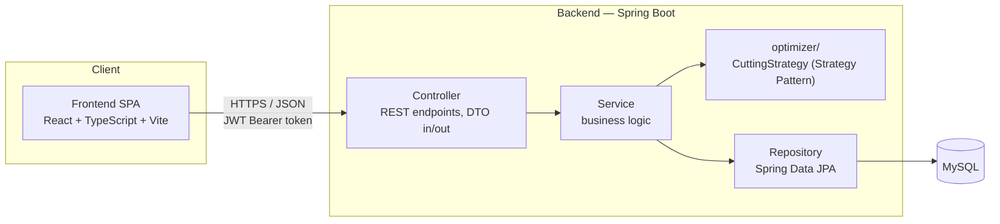

# 3.2 Kiến trúc tổng quan hệ thống

Hệ thống được xây dựng theo mô hình **client-server 3 tầng** kinh điển: một ứng dụng frontend dạng SPA (Single Page Application) giao tiếp với backend qua REST API, backend xử lý toàn bộ nghiệp vụ (bao gồm thuật toán sinh phương án cắt) và lưu trữ dữ liệu trong MySQL. Lựa chọn này phù hợp với quy mô một ứng dụng quản trị nội bộ dùng bởi một nhóm nhỏ người dùng (PLANNER, ADMIN), không cần đến kiến trúc microservices hay các cơ chế xử lý phân tán — trọng tâm khóa luận là chất lượng thiết kế và tính đúng đắn của thuật toán cắt, không phải bài toán về quy mô hạ tầng.



## 3.2.1 Kiến trúc phân lớp (backend)

Backend tổ chức theo **kiến trúc phân lớp (layered architecture)** cổ điển, mỗi lớp chỉ phụ thuộc vào lớp ngay dưới nó, đảm bảo tách biệt rõ trách nhiệm và dễ kiểm thử độc lập từng lớp:

- **Controller** — tiếp nhận HTTP request, xác thực đầu vào ở mức hình thức (validation annotation), chuyển đổi qua DTO và gọi Service tương ứng; không chứa logic nghiệp vụ. Đây cũng là nơi áp dụng kiểm soát phân quyền theo vai trò (`@PreAuthorize`) cho từng endpoint.
- **Service** — nơi đặt toàn bộ logic nghiệp vụ: quy tắc import dữ liệu, tính nhu cầu cắt từ BOM, điều phối thuật toán sinh phương án cắt, kiểm tra ràng buộc phân quyền ở mức nghiệp vụ (không chỉ ở tầng Controller). Service không phụ thuộc vào chi tiết HTTP hay chi tiết truy vấn SQL.
- **optimizer** (module con của Service) — cài đặt thuật toán sinh phương án cắt qua interface `CuttingStrategy`, tách riêng khỏi phần điều phối nghiệp vụ còn lại của Service để có thể kiểm thử và thay thế độc lập (xem 3.2.2).
- **Repository** — lớp truy cập dữ liệu, dùng Spring Data JPA, không chứa logic nghiệp vụ, chỉ chịu trách nhiệm truy vấn/lưu trữ.
- **Domain** — các entity JPA ánh xạ trực tiếp sang bảng MySQL (xem ERD ở mục 3.3), là nguồn sự thật duy nhất về cấu trúc dữ liệu nghiệp vụ.

Một request đi qua đúng một chiều Controller → Service → (Repository | optimizer) → Domain; không có lớp nào gọi ngược lớp phía trên, giúp luồng dữ liệu dễ theo dõi và mỗi lớp có thể unit test bằng cách mock lớp liền dưới.

## 3.2.2 Strategy Pattern cho thuật toán cắt

Thuật toán sinh phương án cắt (BFD mở rộng 4 mức ưu tiên, xem `docs/sequence-diagrams.md` mục "2. Luồng sinh phương án cắt (luồng lõi)") được đóng gói qua một interface duy nhất:

```java
public interface CuttingStrategy {
    CuttingPlanResult computePlan(List<CuttingDemand> demands, InventoryPool pool);
}
```

Việc tách interface này khỏi phần điều phối nghiệp vụ (`CuttingPlanService` — điều phối luồng: gọi `CuttingDemandService` để sinh `CuttingDemand` từ BOM, gọi `CuttingStrategy` để tính phương án, rồi lưu `CuttingPlanResult` cùng cập nhật tồn kho, xem chi tiết ở `docs/sequence-diagrams.md`) tuân theo nguyên tắc Open/Closed: thêm một chiến lược cắt khác (ví dụ một cách tiếp cận dựa trên ILP để làm đối chứng ở Chương 4) chỉ cần thêm một lớp cài đặt mới `implements CuttingStrategy`, không cần sửa Controller, Service điều phối hay Repository. Đây cũng là lý do khóa luận không chọn ILP/OR-Tools làm engine chính ngay từ đầu — tránh native dependency nặng trong khi mục tiêu đánh giá là chất lượng kiến trúc, nhưng vẫn giữ đường mở rộng sang benchmark thuật toán khác nếu cần.

## 3.2.3 DTO và Mapper — tách domain khỏi API contract

Controller không bao giờ nhận hoặc trả trực tiếp entity JPA; mọi request/response đi qua DTO riêng, chuyển đổi qua entity bằng MapStruct (sinh code tại compile-time, không dùng reflection runtime). Lý do tách riêng hai mô hình:

- Entity domain phản ánh đúng ràng buộc CSDL (ví dụ quan hệ N-N giữa `CuttingPlanDetail` và `SalesOrder`, mục 3.3), trong khi API contract cần một hình thức đơn giản, ổn định cho frontend — hai mối quan tâm này thay đổi độc lập với nhau.
- Tránh lộ chi tiết nội bộ (ví dụ trường kỹ thuật dùng cho thuật toán) ra ngoài API, và tránh vòng lặp serialize vô hạn khi entity có quan hệ hai chiều.

## 3.2.4 Tổ chức mã nguồn

```
GraduationtThesis/
├── backend/                # Spring Boot 4.1.1 (Java 21 target, build JDK 23), Maven
│   └── src/main/java/com/slatcut/cutting/
│       ├── domain/         # Entity JPA
│       ├── repository/     # Spring Data JPA repositories
│       ├── service/        # Business logic (interfaces + impl)
│       │   └── optimizer/  # Strategy pattern: CuttingStrategy + BestFitDecreasingStrategy
│       ├── controller/     # REST controllers (DTO in/out only)
│       ├── dto/
│       ├── security/       # JWT filter, Spring Security config
│       ├── mapper/         # MapStruct entity<->DTO
│       └── config/
│   └── src/test/java/...   # JUnit5 + Mockito (unit), Testcontainers (integration)
├── frontend/                # React + TypeScript + Vite
│   └── src/
│       ├── features/{auth,sales-orders,inventory,bom,cutting-plans}/
│       ├── components/      # shared UI (Table, CuttingBarChart svg component,...)
│       ├── api/              # axios client + generated types
│       └── app/              # routing, layout
├── docs/                    # tài liệu thiết kế: use case, ERD, sơ đồ luồng nghiệp vụ (chương 3)
├── dataset/                 # data thật, đã .gitignore (dùng để test/import cục bộ)
├── docker-compose.yml        # mysql + backend + frontend, dùng cho demo bảo vệ
└── .github/workflows/ci.yml  # build + test backend & frontend
```

Frontend tổ chức theo **feature folder** (`features/auth`, `features/sales-orders`, `features/inventory`, `features/bom`, `features/cutting-plans`) thay vì chia theo loại file (tất cả component ở một chỗ, tất cả hook ở một chỗ...), để mỗi nhóm chức năng ở mục yêu cầu chức năng (3.1.3) ứng với đúng một thư mục độc lập, dễ đối chiếu khi phát triển và dễ mở rộng thêm nhóm chức năng mới sau này mà không ảnh hưởng các nhóm khác.

## 3.2.5 Xác thực và phân quyền

Xác thực dùng JSON Web Token (JWT): `POST /auth/login` trả token, mọi request tiếp theo gửi kèm token qua header `Authorization: Bearer`. Một filter ở tầng Spring Security xác thực token trước khi request đến Controller; phân quyền theo vai trò (ADMIN/PLANNER) được kiểm tra khai báo ngay tại Controller bằng annotation, khớp với ranh giới trách nhiệm đã xác định ở use case diagram (mục 3.1.2) — PLANNER không thể gọi các endpoint quản lý BOM hay tài khoản, ADMIN không có endpoint riêng cho việc chạy thuật toán cắt hằng ngày.
