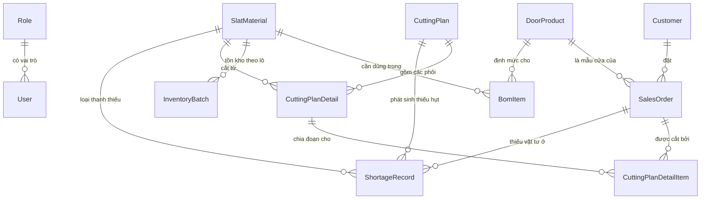

# 3.3.1 Mô hình domain (danh sách entity & quan hệ)

Mục này xác định danh sách entity nghiệp vụ và quan hệ giữa chúng ở mức khái niệm, trước khi ánh xạ sang bảng MySQL cụ thể (kiểu dữ liệu, khóa, chỉ mục) ở mục 3.3.2. Các entity được tổng hợp từ ba nguồn dữ liệu thật đã phân tích (`bom_dinh_muc`, `ton_kho_thanh_nan`, `don_hang`, ở `dataset/processed/`).

**Quy ước đặt tên trường**: tên trường ưu tiên **khớp nguyên văn với tên cột trong file dữ liệu thật** (thay vì đặt tên chung rồi ghi chú cột nguồn trong ngoặc) — để đối chiếu entity ↔ dataset trực tiếp, không cần tra ngược. Riêng các entity không xuất phát từ 1 file dữ liệu thật cụ thể (`Role`, `User`, và toàn bộ nhóm `CuttingPlan*`/`ShortageRecord` — đều là kết quả tính toán, không phải dữ liệu import) vẫn giữ tên tiếng Anh generic như cũ, vì không có cột nguồn nào để khớp.

## Danh sách entity

| Entity | Vai trò | Trường chính |
|---|---|---|
| `Role` | Vai trò tài khoản (ADMIN, PLANNER) | `code`, `name` |
| `User` | Tài khoản đăng nhập | `username`, `passwordHash`, `roleId` |
| `Customer` | Khách hàng đặt đơn (nguồn: `don_hang.csv`) | `customer`, `customerName` |
| `DoorProduct` | Mẫu cửa + màu cụ thể (nguồn: `bom_dinh_muc.csv`) | `material`, `doorMaterialName`, `zMauSac` |
| `SlatMaterial` | Loại thanh nan (nguồn: `bom_dinh_muc.csv` + `ton_kho_thanh_nan.csv`, xem lưu ý đặt tên ở dưới) | `slatMaterial`, `slatMaterialName`, `slatGroup` (Nan chính/Nan phụ/Thanh đáy/Ray/Khác) |
| `BomItem` | Định mức: 1 `DoorProduct` cần bao nhiêu đoạn của 1 `SlatMaterial` (nguồn: `bom_dinh_muc.csv`, đã xác nhận công thức chính xác — xem 3.3.2) | `widthOffsetM`, `heightOffsetM`, `slatCountSlope`, `slatCountIntercept`, `slatCountR2`, `dinhMucMPerM2`, `dinhMucTbMPerBoCua`, `boCuaCount` |
| `InventoryBatch` | Một lô tồn kho: 1 `SlatMaterial` ở 1 độ dài chuẩn, còn bao nhiêu thanh (nguồn: `ton_kho_thanh_nan.csv`) | `doDaiThanhMm`, `soThanh`, `stockStatus` |
| `SalesOrder` | 1 bộ cửa cụ thể trong 1 lô sản xuất — đơn vị ưu tiên cắt (nguồn: `don_hang.csv`) | `ycsx`, `zItem` (khóa nghiệp vụ), `zChieuCaoDh`, `zChieuRongDh`, `reqdDeliveryDate` |
| `CuttingPlan` | Header 1 lần chạy thuật toán | `runAt`, `status`, `totalWasteM`, `scopeCutoffDate`, `scopeOrderCount` |
| `CuttingPlanDetail` | 1 hoặc nhiều phôi tồn kho vật lý **giống nhau** (cùng độ dài, cùng pattern, cùng tập đơn hàng phân bổ) đã dùng trong 1 lần chạy | `patternCode`, `remainderMm`, `remainderType` (DISCARD/RESTOCK/WASTE), `stickCount` |
| `CuttingPlanDetailItem` | Bảng nối: 1 phôi (`CuttingPlanDetail`) phục vụ 1 `SalesOrder` (1 bộ cửa), có thể nhiều dòng/phôi | `cutLengthMm`, `cutQuantity`, `isOriginalOrder` |
| `ShortageRecord` | Ghi nhận thiếu vật tư cho 1 `SlatMaterial` của 1 `SalesOrder` trong 1 lần chạy | `missingQuantity`, `missingLengthM` |

## Quan hệ giữa các entity

Năm điểm cần lưu ý, đều xuất phát từ việc đối chiếu với báo cáo thật PLANNER đang dùng và dữ liệu thật ở `dataset/`, chứ không phải phác thảo domain model ban đầu:

**1. `SalesOrder` không tách header/detail — gộp `SalesOrder`+`SalesOrderLine` (bản trước) thành 1 entity duy nhất, đúng theo grain của `don_hang.csv`.** Đối chiếu toàn bộ 190 dòng dữ liệu thật: `z_chieu_cao_dh`/`z_chieu_rong_dh` (kích thước cửa), `customer`, `reqd_delivery_date` **đều thay đổi tự do giữa các dòng cùng `ycsx`** (ví dụ 1 `ycsx` có tới 5 độ rộng khác nhau, hoặc 3 khách hàng + 3 ngày giao khác nhau) — tức `ycsx` là một **lô sản xuất** gộp nhiều đơn của nhiều khách khác nhau lại để cắt chung, không phải header "1 đơn của 1 khách" như giả định ban đầu. Không có thuộc tính nghiệp vụ nào thực sự dùng chung ổn định ở mức `ycsx` (ngoài chính `ycsx` là một nhãn gộp lô), nên tách bảng header riêng chỉ tạo ra 1 bảng gần như rỗng. Đồng thời xác nhận `total_order_quantity` luôn đúng bằng `z_dien_tich_dh` (diện tích = cao×rộng) ở toàn bộ 190 dòng — mỗi dòng (`ycsx`, `z_item`) luôn là **đúng 1 bộ cửa**, không có khái niệm "số lượng bộ" độc lập trên 1 dòng — nên `SalesOrder` không cần trường `quantity`.

**2. `CuttingPlanDetail` — `SalesOrder` là quan hệ N-N, qua `CuttingPlanDetailItem`, không phải 1-1.** Ở Mức 2 (cắt bội số) và Mức 3 (ghép nối) của thuật toán, một phôi tồn kho có thể đồng thời phục vụ nhiều bộ cửa khác nhau — báo cáo mức chi tiết nhất (xuất kho theo phôi) cần thể hiện rõ **đơn hàng gốc** và **đơn hàng ghép thêm** dùng chung phôi đó. `CuttingPlanDetailItem` là bảng nối mang cờ `isOriginalOrder` để phân biệt hai vai trò này khi hiển thị, cùng `cutLengthMm`/`cutQuantity` cho biết đoạn cắt cụ thể của đơn đó trên phôi.

**3. `CuttingDemand` không phải là entity được lưu trữ.** Nhu cầu cắt (tổ hợp `slatMaterial`, `cutLength`, `quantity`, `dueDate`, `ycsx`/`zItem` — sinh từ `SalesOrder` × `BomItem`) chỉ là đối tượng tạm thời, tính lại mỗi lần chạy thuật toán, không cần bảng riêng: một khi đã có kết quả, nó được phản ánh đầy đủ qua `CuttingPlanDetailItem` (nếu cắt được) hoặc `ShortageRecord` (nếu thiếu vật tư). Lưu `CuttingDemand` như 1 entity sẽ tạo dữ liệu trùng lặp, không có giá trị tra cứu riêng.

**4. `CuttingPlanDetail.stickCount` — gộp nhiều phôi giống nhau thành 1 dòng, thay vì 1 dòng/1 phôi.** Đối chiếu `dataset/processed/ton_kho_thanh_nan.csv`: tồn kho thật lưu song song cả tổng số mét (`ton_m`) **và số lượng thanh** (`so_thanh`), với `ton_m = so_thanh × độ dài` luôn đúng chính xác (không có trường hợp lệch) — chứng tỏ tồn kho luôn là số nguyên lần độ dài chuẩn, và số lượng thanh là đơn vị vận hành thật, không phải mét là đơn vị chính. Điều này khớp với báo cáo mức chi tiết nhất ở `docs/requirements-functional.md` ("độ dài phôi tồn kho, **số lượng phôi dùng** ở độ dài đó, và một mã phương án cắt") — khi nhiều phôi cùng pattern cùng phục vụ đúng 1 tập đơn hàng (điển hình ở Mức 2 — cắt bội số, ví dụ "15 thanh 6m cắt đôi" đều phục vụ đúng 1 đơn), báo cáo gộp thành 1 dòng có cột số lượng, không tách 15 dòng riêng. `stickCount` (mặc định 1) chỉ được gộp > 1 khi tất cả các phôi trong nhóm có **cùng `patternCode` và cùng tập `CuttingPlanDetailItem` phân bổ** — bất biến này do tầng Service đảm bảo khi lưu, không có ràng buộc DB nào enforce được.

**5. Không cần cột trạng thái riêng cho "đơn thuộc nhóm 99".** Theo thuật toán (`docs/sequence-diagrams.md`, luồng sinh phương án cắt), phạm vi mỗi lần chạy được xác định **động** tại thời điểm chạy (`reqd_delivery_date <= t+3` và đơn "chưa được cắt"), không phải một trạng thái cố định gán sẵn cho đơn hàng. "Chưa được cắt" được suy ra trực tiếp từ việc `SalesOrder` đó **chưa có `CuttingPlanDetailItem`/`ShortageRecord` nào tham chiếu tới** — tức đơn chưa từng được đưa vào bất kỳ lần chạy nào. Một khi đơn đã được đưa vào 1 lần chạy (dù kết quả là đủ toàn phần, đủ từng phần, hay thiếu vật tư ở một số dòng), đơn đó được coi là đã xử lý xong và không được thuật toán tự động đưa lại vào lần chạy sau — đúng với phạm vi khóa luận (việc bổ sung vật tư thiếu là việc của hệ thống lập kế hoạch sản xuất ở giai đoạn sau, không phải việc tự động re-queue của thuật toán này). Vì vậy "nhóm 99" chỉ là cách gọi nghiệp vụ cho tập đơn **chưa có bản ghi kết quả nào** tại một thời điểm — không cần persist thành cột riêng, tránh rủi ro cột trạng thái bị lệch với dữ liệu thật (stale state).

## Ghi chú khác

- **"Đợt cắt" (đợt rút vật tư)** ở báo cáo mức tổng quan — nhóm theo `DoorProduct` (mẫu cửa + màu), tối đa 7 bộ/đợt — **không phải một entity riêng**. Đây là kết quả tính toán tại thời điểm hiển thị/xuất báo cáo (group theo `DoorProduct` trên tập `CuttingPlanDetailItem`/`SalesOrder` của 1 `CuttingPlan`, sắp theo `reqd_delivery_date`), suy ra hoàn toàn từ dữ liệu đã có, nên không cần bảng lưu trữ riêng — tránh phải đồng bộ lại nếu logic nhóm đợt cắt thay đổi sau này.
- `Role` giữ là bảng riêng (không phải enum trên `User`) để mở khả năng bổ sung vai trò mới sau khóa luận mà không cần đổi schema, dù ở phạm vi MVP chỉ có đúng 2 giá trị (ADMIN, PLANNER).
- `BomItem` về bản chất là bảng nối N-N giữa `DoorProduct` và `SlatMaterial`, mang thêm các thuộc tính công thức (offset, hệ số hồi quy số lượng đoạn) — không cần bảng nối trung gian nào khác.
- **`SlatMaterial` gom dữ liệu từ 2 file có tên cột khác nhau cho cùng 1 khái niệm**: `bom_dinh_muc.csv` gọi là `slat_material`/`slat_material_name`, nhưng `ton_kho_thanh_nan.csv` lại gọi chính khái niệm này là `material`/`material_description` (vì trong SAP, "material" là tên gọi chung cho mọi loại vật tư, không riêng gì thanh nan). Domain model chọn `slatMaterial`/`slatMaterialName` (theo `bom_dinh_muc.csv`) làm tên chuẩn; khi viết `ExcelImportService` cho tồn kho, cần map cột `material`/`material_description` của `ton_kho_thanh_nan.csv` vào đúng 2 trường này — **không được nhầm với `DoorProduct.material`** (cột tên giống nhau nhưng là 2 khái niệm khác nhau ở 2 file).

# 3.3.2 Ánh xạ sang bảng MySQL (ERD chi tiết)

Mục này ánh xạ các entity ở mục 3.3.1 sang bảng MySQL cụ thể: tên bảng, kiểu dữ liệu cột, khóa chính/khóa ngoại, ràng buộc UNIQUE và chỉ mục.

## Quy ước chung

- **Khóa chính**: mọi bảng dùng `id BIGINT AUTO_INCREMENT PRIMARY KEY` (chiến lược `GenerationType.IDENTITY` của Spring Data JPA), không dùng khóa nghiệp vụ (`ycsx`, `customer`,...) làm khóa chính trực tiếp — các trường này vẫn được đánh UNIQUE để đảm bảo tính duy nhất, nhưng để khóa chính là số nguyên tự tăng giúp khóa ngoại ở bảng con nhẹ hơn và không bị ảnh hưởng nếu định dạng khóa nghiệp vụ thay đổi.
- **Tên cột khớp dataset**: với các bảng có nguồn từ 1 file dữ liệu thật (`customer`, `door_product`, `slat_material`, `bom_item`, `inventory_batch`, `sales_order`), tên cột **giữ nguyên văn** theo tên cột trong file CSV/Excel gốc ở `dataset/` (kể cả khi đó là tên viết tắt tiếng Việt như `ycsx`, `z_chieu_cao_dh`, `do_dai_thanh_mm`) — mục đích để đối chiếu cột ↔ dataset trực tiếp khi viết `ExcelImportService`, không cần tra bảng mapping riêng. Các bảng không có nguồn dữ liệu thật (`role`, `app_user`, `cutting_plan` và các bảng con, `shortage_record`) vẫn dùng tên tiếng Anh generic.
- **Đơn vị độ dài**: trường tên kết thúc bằng `_mm` (mm, ví dụ `cut_length_mm`, `do_dai_thanh_mm`) lưu số nguyên (`INT`) — dùng cho các phép tính cắt cần chính xác tuyệt đối, tránh sai số dấu phẩy động khi cộng trừ nhiều đoạn. Trường kết thúc bằng `_m` (mét, ví dụ `total_waste_m`, `missing_length_m`) là số liệu tổng hợp/báo cáo, lưu `DECIMAL(10,2)`. Tồn kho (`inventory_batch`) là ngoại lệ — lưu trực tiếp số lượng thanh (`so_thanh`, số nguyên) thay vì tổng mét, xem giải thích ở bảng `inventory_batch`.
- **Tên bảng/cột trùng từ khóa dự trữ của MySQL**: entity `User` ánh xạ sang bảng `app_user` (`USER` là từ khóa dự trữ trong MySQL 8); trường `group` của `SlatMaterial` ánh xạ sang cột `slat_group` (tránh trùng `GROUP BY`).
- **Timestamp**: bảng dữ liệu nền tảng/nghiệp vụ có thể chỉnh sửa qua thời gian (Nhóm 1, Nhóm 2 yêu cầu chức năng) có thêm `created_at`, `updated_at DATETIME`. Bảng lưu kết quả một lần chạy thuật toán (`cutting_plan` và các bảng con) không cần `updated_at` vì chỉ ghi một lần, không có luồng chỉnh sửa sau đó.

## Sơ đồ ERD chi tiết

Sơ đồ dưới đây thể hiện đúng 11 bảng vật lý và các khóa ngoại tương ứng — cùng bộ quan hệ như sơ đồ khái niệm ở 3.3.1, nay gắn với tên bảng/cột thật và đánh dấu khóa chính (PK), khóa ngoại (FK), khóa duy nhất (UK).

```mermaid
erDiagram
    role {
        bigint id PK
        varchar code UK
        varchar name
    }
    app_user {
        bigint id PK
        varchar username UK
        varchar password_hash
        bigint role_id FK
        boolean enabled
    }
    customer {
        bigint id PK
        bigint customer UK
        varchar customer_name
    }
    door_product {
        bigint id PK
        bigint material UK "cùng z_mau_sac"
        varchar door_material_name
        varchar z_mau_sac UK "cùng material"
    }
    slat_material {
        bigint id PK
        bigint slat_material UK "alias material ở ton_kho_thanh_nan"
        varchar slat_material_name
        enum slat_group "5 giá trị, xem chú thích"
    }
    bom_item {
        bigint id PK
        bigint door_product_id FK "cùng slat_material_id"
        bigint slat_material_id FK "cùng door_product_id"
        decimal width_offset_m "nullable"
        decimal height_offset_m "nullable"
        decimal slat_count_slope "nullable, xem chú thích"
        decimal slat_count_intercept "nullable, xem chú thích"
        decimal slat_count_r2 "nullable"
        decimal dinh_muc_m_per_m2 "nullable"
        decimal dinh_muc_tb_m_per_bo_cua "nullable, xem chú thích"
        int bo_cua_count "nullable, thông tin tham khảo"
    }
    inventory_batch {
        bigint id PK
        bigint slat_material_id FK "cùng do_dai_thanh_mm"
        int do_dai_thanh_mm UK "cùng slat_material_id"
        int so_thanh
        enum stock_status "nhãn hạn dùng tồn kho, xem chú thích"
    }
    sales_order {
        bigint id PK
        varchar ycsx UK "cùng z_item"
        int z_item UK "cùng ycsx"
        bigint customer_id FK
        bigint door_product_id FK
        decimal z_chieu_cao_dh
        decimal z_chieu_rong_dh
        date reqd_delivery_date
    }
    cutting_plan {
        bigint id PK
        datetime run_at
        enum status
        decimal total_waste_m
        date scope_cutoff_date
        int scope_order_count
    }
    cutting_plan_detail {
        bigint id PK
        bigint cutting_plan_id FK
        bigint slat_material_id FK
        int source_length_mm
        varchar pattern_code
        int remainder_mm
        enum remainder_type
        int stick_count "xem chú thích"
    }
    cutting_plan_detail_item {
        bigint id PK
        bigint cutting_plan_detail_id FK "cùng sales_order_id"
        bigint sales_order_id FK "cùng cutting_plan_detail_id"
        int cut_length_mm
        int cut_quantity
        boolean is_original_order
    }
    shortage_record {
        bigint id PK
        bigint cutting_plan_id FK "cùng sales_order_id, slat_material_id"
        bigint sales_order_id FK "cùng cutting_plan_id, slat_material_id"
        bigint slat_material_id FK "cùng cutting_plan_id, sales_order_id"
        int missing_quantity
        decimal missing_length_m
    }

    role ||--o{ app_user : "có vai trò"
    customer ||--o{ sales_order : "đặt"
    door_product ||--o{ sales_order : "là mẫu cửa của"
    door_product ||--o{ bom_item : "định mức cho"
    slat_material ||--o{ bom_item : "cần dùng trong"
    slat_material ||--o{ inventory_batch : "tồn kho theo lô"
    slat_material ||--o{ cutting_plan_detail : "cắt từ"
    cutting_plan ||--o{ cutting_plan_detail : "gồm các phôi"
    cutting_plan ||--o{ shortage_record : "phát sinh thiếu hụt"
    cutting_plan_detail ||--o{ cutting_plan_detail_item : "chia đoạn cho"
    sales_order ||--o{ cutting_plan_detail_item : "được cắt bởi"
    sales_order ||--o{ shortage_record : "thiếu vật tư ở"
    slat_material ||--o{ shortage_record : "loại thanh thiếu"
```

Chú thích `"cùng ..."` trên một cột đánh dấu UK/FK nghĩa là ràng buộc UNIQUE hoặc mục đích của khóa ngoại đó là **composite** (nhiều cột cộng lại), mermaid không có ký hiệu riêng cho UNIQUE nhiều cột nên ghi chú trực tiếp bên cạnh — ví dụ `door_product.material` + `door_product.z_mau_sac` là một UNIQUE tổ hợp (không phải hai UNIQUE riêng lẻ). Chú thích `"nullable"`/`"xem chú thích"` đánh dấu các cột có ràng buộc hoặc quyết định thiết kế cần giải thích thêm ở phần bảng chi tiết bên dưới (không đủ chỗ ghi trực tiếp trên sơ đồ).

## Bảng dữ liệu nền tảng

### `role`
| Cột | Kiểu | Ràng buộc |
|---|---|---|
| id | BIGINT | PK |
| code | VARCHAR(20) | NOT NULL, UNIQUE |
| name | VARCHAR(100) | NOT NULL |

### `app_user`
| Cột | Kiểu | Ràng buộc |
|---|---|---|
| id | BIGINT | PK |
| username | VARCHAR(50) | NOT NULL, UNIQUE |
| password_hash | VARCHAR(255) | NOT NULL |
| role_id | BIGINT | NOT NULL, FK → `role.id` |
| enabled | BOOLEAN | NOT NULL, DEFAULT TRUE |
| created_at / updated_at | DATETIME | NOT NULL |

`enabled` bổ sung so với danh sách trường chính ở 3.3.1, phục vụ đúng yêu cầu "ADMIN khóa tài khoản PLANNER" ở Nhóm 4 — khóa tài khoản là đổi cờ, không xóa bản ghi.

### `customer`
| Cột | Kiểu | Ràng buộc |
|---|---|---|
| id | BIGINT | PK |
| customer | BIGINT | NOT NULL, UNIQUE |
| customer_name | VARCHAR(255) | NOT NULL |
| created_at / updated_at | DATETIME | NOT NULL |

Cột `customer` (mã khách hàng SAP, ví dụ `1000000634`) khớp nguyên văn cột `customer` ở `don_hang.csv`; kiểu `BIGINT` vì toàn bộ giá trị mẫu là số nguyên không có số 0 dẫn đầu.

### `door_product`
| Cột | Kiểu | Ràng buộc |
|---|---|---|
| id | BIGINT | PK |
| material | BIGINT | NOT NULL |
| door_material_name | VARCHAR(255) | NOT NULL |
| z_mau_sac | VARCHAR(20) | NOT NULL |
| created_at / updated_at | DATETIME | NOT NULL |

UNIQUE (`material`, `z_mau_sac`): xác nhận đúng với dữ liệu thật — cùng 1 `material` có thể tồn tại ở nhiều màu khác nhau (ví dụ `material=21000870` xuất hiện với `z_mau_sac` = `#02`/`#03`/`#05` trong `bom_dinh_muc.csv`), mỗi tổ hợp là một `DoorProduct` riêng.

### `slat_material`
| Cột | Kiểu | Ràng buộc |
|---|---|---|
| id | BIGINT | PK |
| slat_material | BIGINT | NOT NULL, UNIQUE |
| slat_material_name | VARCHAR(255) | NOT NULL |
| slat_group | ENUM('MAIN_SLAT','SUB_SLAT','BOTTOM_BAR','RAIL','OTHER') | NOT NULL |
| created_at / updated_at | DATETIME | NOT NULL |

5 giá trị `slat_group` đối chiếu trực tiếp với `dataset/processed/bom_dinh_muc.csv` cột `slat_group` (5 giá trị thật: Thanh đáy, Nan chính, Nan phụ, Ray, **Khác**). Cột `slat_material`/`slat_material_name` lấy tên theo `bom_dinh_muc.csv` — khi import từ `ton_kho_thanh_nan.csv` phải map từ cột `material`/`material_description` của file đó (xem "Ghi chú khác" ở 3.3.1).

### `bom_item`
| Cột | Kiểu | Ràng buộc |
|---|---|---|
| id | BIGINT | PK |
| door_product_id | BIGINT | NOT NULL, FK → `door_product.id` |
| slat_material_id | BIGINT | NOT NULL, FK → `slat_material.id` |
| width_offset_m | DECIMAL(6,3) | NULL |
| height_offset_m | DECIMAL(6,3) | NULL |
| slat_count_slope | DECIMAL(10,6) | NULL |
| slat_count_intercept | DECIMAL(10,4) | NULL |
| slat_count_r2 | DECIMAL(5,4) | NULL |
| dinh_muc_m_per_m2 | DECIMAL(10,4) | NULL |
| dinh_muc_tb_m_per_bo_cua | DECIMAL(10,4) | NULL |
| bo_cua_count | INT | NULL |
| created_at / updated_at | DATETIME | NOT NULL |

UNIQUE (`door_product_id`, `slat_material_id`): đã đối chiếu toàn bộ 1.860 dòng `dataset/processed/bom_dinh_muc.csv` theo đúng khóa (`material`, `z_mau_sac`, `slat_material`) — 0 trùng lặp, xác nhận ràng buộc này đúng với dữ liệu thật.

**Công thức fallback đã được xác nhận đầy đủ** (theo giải thích của PLANNER về nguồn view `v_door_slats_norm` → `v_mps_kc04_slats_demand`) — chi tiết pseudocode đầy đủ ở mục "Công thức tính nhu cầu cắt" trong `docs/sequence-diagrams.md`. Tóm tắt vai trò từng cột:
- `width_offset_m`, `height_offset_m`: dùng trực tiếp trong công thức (không phải chỉ tham khảo) — offset trừ vào chiều rộng/chiều cao cửa để ra độ dài cắt thực tế.
- `slat_count_slope`, `slat_count_intercept`, `slat_count_r2`: dùng cho nan chính — hồi quy số lượng thanh theo chiều cao, chỉ tin khi `slat_count_r2 >= 0.5`.
- `dinh_muc_m_per_m2`: fallback tính số lượng thanh cho nan chính khi hồi quy không đủ tin cậy (`slat_count_r2 < 0.5` hoặc NULL).
- `dinh_muc_tb_m_per_bo_cua`: fallback toàn phần (tổng độ dài cần) khi không đủ dữ liệu để tính `cutDimM`/`requiredPieces` theo công thức riêng của từng nhóm.
- `bo_cua_count`: **không dùng trong công thức tính cắt**, chỉ là số lệnh sản xuất lịch sử dùng để suy ra định mức này — giữ lại để ADMIN đánh giá độ tin cậy khi tra cứu định mức (đúng yêu cầu "kiểm tra tính hợp lệ trước khi áp dụng" ở Nhóm 2 yêu cầu chức năng).

**Các cột có trong dữ liệu thật (`v_door_slats_norm.xlsx`) nhưng chủ động không đưa vào schema** vì không dùng trong công thức tính nhu cầu cắt, không phải chỉ vì "chưa chắc" như bản trước:
- `avg_door_height_m`, `avg_door_width_m`, `total_door_area_m2`, `total_issue_qty_m`: chỉ là số liệu thống kê/trung gian dùng để suy ra `dinh_muc_m_per_m2`/`dinh_muc_tb_m_per_bo_cua` ở phía nguồn, không cần lưu lại.
- `width_offset_freq`, `height_offset_freq`, `slat_count_n_obs`, `is_pooled_across_colors`, `is_pooled_across_models`: cờ/chỉ số nội bộ phục vụ việc phía nguồn tự tính ra định mức đáng tin hay không — hệ thống của khóa luận chỉ tiêu thụ kết quả cuối (`bom_dinh_muc.csv`) nên không cần các cờ này.
- `slat_uom` (đơn vị tính): luôn là mét trong toàn bộ hệ thống, không cần lưu.
- `plant` (nhà máy): khóa join ở nguồn nhưng hệ thống chỉ phục vụ đúng 1 nhà máy trong phạm vi khóa luận, nên bỏ qua — nếu sau này mở rộng đa nhà máy mới cần thêm cột này vào khóa UNIQUE.

### `inventory_batch`
| Cột | Kiểu | Ràng buộc |
|---|---|---|
| id | BIGINT | PK |
| slat_material_id | BIGINT | NOT NULL, FK → `slat_material.id` |
| do_dai_thanh_mm | INT | NOT NULL |
| so_thanh | INT | NOT NULL, DEFAULT 0 |
| stock_status | ENUM('OVER_6_MONTHS','3_TO_6_MONTHS','UNDER_3_MONTHS') | NOT NULL |
| created_at / updated_at | DATETIME | NOT NULL |

`stock_status` không phải cờ AVAILABLE/DEPLETED mà là **nhãn hạn dùng tồn kho thật** (`dataset/processed/ton_kho_thanh_nan.csv` cột `stock_status`, 3 giá trị: "Hữu dụng trên 6 tháng"/"3-6 tháng"/"dưới 3 tháng"). Đối chiếu dữ liệu thật: `ton_m = so_thanh × độ dài` đúng chính xác ở toàn bộ 2.283 dòng — tồn kho luôn là số nguyên lần độ dài chuẩn, nên lưu trực tiếp số lượng thanh (`so_thanh`) làm nguồn số liệu chính xác tuyệt đối; tổng số mét (nếu cần hiển thị cho PLANNER đúng theo yêu cầu chức năng Nhóm 1) tính lại từ `so_thanh × do_dai_thanh_mm / 1000`, không lưu trùng lặp.

UNIQUE (`slat_material_id`, `do_dai_thanh_mm`): xác nhận đúng với dữ liệu thật (0 trùng lặp trên (`material`, `do_dai_thanh_mm`) trong toàn bộ 2.283 dòng) — mỗi tổ hợp loại thanh + độ dài chỉ có 1 dòng, không tách theo `stock_status`. Nhập Excel/cập nhật thủ công là upsert cộng/trừ vào `so_thanh`, kể cả khi thuật toán "nhập lại kho" phần dư > 3m ở Mức 4.

**Đã xác nhận: `stock_status` không ảnh hưởng đến thứ tự thuật toán chọn thanh để cắt.** Thuật toán vẫn luôn xử lý theo đúng thứ tự ưu tiên đã chốt (`reqd_delivery_date`, `ycsx`, `z_item`), không ưu tiên chọn thanh theo hạn dùng. `stock_status` chỉ mang tính tham khảo tồn kho; lô nào ở trạng thái hết hạn coi như không còn trong kho (không được `InventoryPool.load()` tải vào), nhưng dữ liệu thật hiện chỉ có 3 giá trị hạn dùng còn hiệu lực ("Hữu dụng trên 6 tháng"/"3-6 tháng"/"dưới 3 tháng"), chưa có giá trị "hết hạn" nào — nên `InventoryPool.load()` hiện tại chỉ cần `INDEX (slat_material_id)` (đã có sẵn từ UNIQUE phía trên), không cần thêm `stock_status` vào chỉ mục.

## Bảng nghiệp vụ đơn hàng

### `sales_order`
| Cột | Kiểu | Ràng buộc |
|---|---|---|
| id | BIGINT | PK |
| ycsx | VARCHAR(20) | NOT NULL |
| z_item | INT | NOT NULL |
| customer_id | BIGINT | NOT NULL, FK → `customer.id` |
| door_product_id | BIGINT | NOT NULL, FK → `door_product.id` |
| z_chieu_cao_dh | DECIMAL(6,3) | NOT NULL |
| z_chieu_rong_dh | DECIMAL(6,3) | NOT NULL |
| reqd_delivery_date | DATE | NOT NULL |
| created_at / updated_at | DATETIME | NOT NULL |

UNIQUE (`ycsx`, `z_item`): khóa nghiệp vụ đúng theo grain của `don_hang.csv` — 1 dòng = 1 bộ cửa cụ thể trong 1 lô sản xuất, xác nhận không có `z_item` nào lặp lại trong cùng `ycsx` trên 190 dòng dữ liệu thật.

`INDEX (reqd_delivery_date)`: cột được lọc (`<= t+3`) và sắp xếp ưu tiên ở mọi lần sinh phương án cắt — cần chỉ mục riêng để truy vấn phạm vi đợt xử lý không phải quét toàn bảng khi số đơn hàng lịch sử tăng dần theo thời gian.

**Các cột có trong `don_hang.csv` nhưng chưa đưa vào schema** (vì chưa có yêu cầu chức năng nào cần dùng, và có thể suy ra hoặc trùng lặp): `item_description`/`material_group` (đã có ở `door_product`), `z_dien_tich_dh`/`total_order_quantity`/`cumul_confirmed_qty`/`base_unit_of_measure` (luôn bằng đúng diện tích cao×rộng, suy ra được, không lưu trùng), `z_lo_cuon` (2 giá trị TRONG/NGOÀI — hướng cuốn, chưa rõ có ảnh hưởng BOM/cắt hay không), `status`, `planned_order_delivery_date`. Nếu về sau phát hiện cần dùng, bổ sung cột tương ứng, tên khớp nguyên văn dataset như quy ước.

## Bảng kết quả phương án cắt

### `cutting_plan`
| Cột | Kiểu | Ràng buộc |
|---|---|---|
| id | BIGINT | PK |
| run_at | DATETIME | NOT NULL |
| status | ENUM('COMPLETED','FAILED') | NOT NULL, DEFAULT 'COMPLETED' |
| total_waste_m | DECIMAL(10,2) | NOT NULL |
| scope_cutoff_date | DATE | NOT NULL |
| scope_order_count | INT | NOT NULL |

Không có `updated_at`: một `CuttingPlan` và toàn bộ bảng con được ghi trong đúng 1 transaction, không có luồng chỉnh sửa sau khi lưu. Giá trị `FAILED` mang tính dự phòng (nếu về sau cần một bước xử lý nhiều giai đoạn có thể thất bại giữa chừng); ở phạm vi khóa luận, transaction rollback khi lỗi thì không có dòng nào được lưu, nên hiện tại chỉ `COMPLETED` được set trong thực tế.

### `cutting_plan_detail`
| Cột | Kiểu | Ràng buộc |
|---|---|---|
| id | BIGINT | PK |
| cutting_plan_id | BIGINT | NOT NULL, FK → `cutting_plan.id` |
| slat_material_id | BIGINT | NOT NULL, FK → `slat_material.id` |
| source_length_mm | INT | NOT NULL |
| pattern_code | VARCHAR(100) | NOT NULL |
| remainder_mm | INT | NOT NULL, DEFAULT 0 |
| remainder_type | ENUM('DISCARD','RESTOCK','WASTE') | NOT NULL |
| stick_count | INT | NOT NULL, DEFAULT 1 |

`INDEX (cutting_plan_id)`.

**`stick_count`: số phôi giống nhau (cùng độ dài nguồn, cùng pattern) được gộp vào 1 dòng.** Khớp với thực tế tồn kho vận hành theo số lượng thanh (`so_thanh` ở `inventory_batch`), không phải 1 dòng/1 thanh; báo cáo mức chi tiết nhất ở `requirements-functional.md` cũng có cột "số lượng phôi dùng ở độ dài đó" riêng với pattern. Chỉ gộp khi các phôi đó có **cùng pattern và cùng tập `CuttingPlanDetailItem` phân bổ** (ví dụ Mức 2 — cắt bội số: "15 thanh 6m cắt đôi" cùng phục vụ 1 đơn → 1 dòng, `stick_count = 15`); nếu các phôi cùng pattern nhưng phục vụ tập đơn khác nhau (ví dụ Mức 3 — ghép nối, mỗi thanh ghép các đơn khác nhau) thì mỗi phôi vẫn phải là 1 dòng riêng (`stick_count = 1`).

**Quyết định thiết kế đáng chú ý: không có khóa ngoại tới `inventory_batch`.** `source_length_mm` copy trực tiếp độ dài phôi tồn kho tại thời điểm cắt, không FK, vì `inventory_batch` là số liệu tổng hợp còn-bao-nhiêu-thanh luôn thay đổi theo thời gian (bị trừ dần trong lúc thuật toán chạy, được cộng thêm khi nhập lại kho phần dư > 3m ở Mức 4) — nếu giữ FK tới đúng dòng `inventory_batch`, lịch sử phương án cắt cũ sẽ bị ảnh hưởng khi dòng đó sau này thay đổi số liệu. Copy giá trị giữ lịch sử phương án cắt bất biến, đúng yêu cầu phi chức năng "kết quả tái lập được".

### `cutting_plan_detail_item`
| Cột | Kiểu | Ràng buộc |
|---|---|---|
| id | BIGINT | PK |
| cutting_plan_detail_id | BIGINT | NOT NULL, FK → `cutting_plan_detail.id` |
| sales_order_id | BIGINT | NOT NULL, FK → `sales_order.id` |
| cut_length_mm | INT | NOT NULL |
| cut_quantity | INT | NOT NULL |
| is_original_order | BOOLEAN | NOT NULL |

UNIQUE (`cutting_plan_detail_id`, `sales_order_id`): một bộ cửa chỉ xuất hiện đúng 1 lần trên 1 phôi cụ thể (nhiều đoạn của cùng bộ cửa trên cùng phôi gộp vào `cut_quantity`, không tách nhiều dòng). `INDEX (sales_order_id)` phục vụ truy vấn suy ra trạng thái "đã xử lý" của một `SalesOrder` (điểm 5, mục 3.3.1): kiểm tra tồn tại bản ghi tham chiếu tới `SalesOrder` đó.

### `shortage_record`
| Cột | Kiểu | Ràng buộc |
|---|---|---|
| id | BIGINT | PK |
| cutting_plan_id | BIGINT | NOT NULL, FK → `cutting_plan.id` |
| sales_order_id | BIGINT | NOT NULL, FK → `sales_order.id` |
| slat_material_id | BIGINT | NOT NULL, FK → `slat_material.id` |
| missing_quantity | INT | NOT NULL |
| missing_length_m | DECIMAL(10,2) | NOT NULL |

UNIQUE (`cutting_plan_id`, `sales_order_id`, `slat_material_id`): trong 1 lần chạy, một bộ cửa chỉ thiếu đúng 1 lần cho 1 loại thanh nan cụ thể. `INDEX (sales_order_id)` dùng cho cùng mục đích suy ra trạng thái xử lý như ở `cutting_plan_detail_item`.
