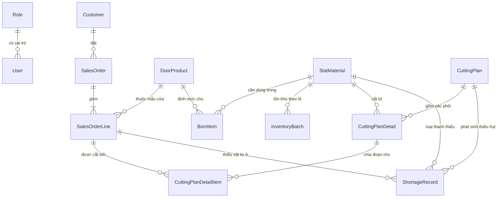

# 3.3.1 Mô hình domain (danh sách entity & quan hệ)

Mục này xác định danh sách entity nghiệp vụ và quan hệ giữa chúng ở mức khái niệm, trước khi ánh xạ sang bảng MySQL cụ thể (kiểu dữ liệu, khóa, chỉ mục) ở mục 3.3.2. Các entity được tổng hợp từ ba nguồn dữ liệu thật đã phân tích (`bom_dinh_muc`, `ton_kho_thanh_nan`, `don_hang`), generic hóa để không phụ thuộc cấu trúc file Excel gốc của doanh nghiệp.

## Danh sách entity

| Entity | Vai trò | Trường chính |
|---|---|---|
| `Role` | Vai trò tài khoản (ADMIN, PLANNER) | `code`, `name` |
| `User` | Tài khoản đăng nhập | `username`, `passwordHash`, `roleId` |
| `Customer` | Khách hàng đặt đơn | `code` (`customer`), `name` (`customer_name`) |
| `DoorProduct` | Mẫu cửa + màu cụ thể | `code` (`material`), `name` (`door_material_name`), `color` (`z_mau_sac`) |
| `SlatMaterial` | Loại thanh nan | `code` (`slat_material`), `name`, `group` (Nan chính/Nan phụ/Thanh đáy/Ray) |
| `BomItem` | Định mức: 1 `DoorProduct` cần bao nhiêu đoạn của 1 `SlatMaterial`, theo công thức từ cao×rộng | `widthOffsetM`, `heightOffsetM`, `slatCountSlope`, `slatCountIntercept`, `r2` |
| `InventoryBatch` | Một lô tồn kho: 1 `SlatMaterial` ở 1 độ dài chuẩn, còn bao nhiêu mét | `lengthMm`, `stockM`, `stockStatus` |
| `SalesOrder` | Đơn hàng khách (đơn vị ưu tiên cắt) | `salesDocument` (khóa nghiệp vụ, so_number), `productionOrderNo` (order/ycsx, chỉ để truy vết), `reqdDeliveryDate`, `heightMm`, `widthMm` |
| `SalesOrderLine` | Dòng chi tiết đơn — 1 mẫu cửa/màu, 1 số lượng bộ | `salesOrderItem` (khóa nghiệp vụ), `quantity` |
| `CuttingPlan` | Header 1 lần chạy thuật toán | `runAt`, `status`, `totalWasteM`, `scopeCutoffDate`, `scopeOrderCount` |
| `CuttingPlanDetail` | 1 phôi tồn kho vật lý đã dùng trong 1 lần chạy, kèm pattern cắt | `patternCode`, `remainderMm`, `remainderType` (DISCARD/RESTOCK/WASTE) |
| `CuttingPlanDetailItem` | Bảng nối: 1 phôi (`CuttingPlanDetail`) phục vụ 1 `SalesOrderLine`, có thể nhiều dòng/phôi | `cutLengthMm`, `cutQuantity`, `isOriginalOrder` |
| `ShortageRecord` | Ghi nhận thiếu vật tư cho 1 `SlatMaterial` của 1 `SalesOrderLine` trong 1 lần chạy | `missingQuantity`, `missingLengthM` |

## Quan hệ giữa các entity

Ba điểm cần lưu ý, đều xuất phát từ việc đối chiếu với báo cáo thật PLANNER đang dùng (mục "Quyết định & ý nghĩa" trong `.claude/CLAUDE.md`) chứ không phải phác thảo domain model ban đầu:

**1. `CuttingPlanDetail` — `SalesOrderLine` là quan hệ N-N, qua `CuttingPlanDetailItem`, không phải 1-1.** Ở Mức 2 (cắt bội số) và Mức 3 (ghép nối) của thuật toán, một phôi tồn kho có thể đồng thời phục vụ nhiều đơn hàng khác nhau — báo cáo mức chi tiết nhất (xuất kho theo phôi) cần thể hiện rõ **đơn hàng gốc** và **đơn hàng ghép thêm** dùng chung phôi đó. `CuttingPlanDetailItem` là bảng nối mang cờ `isOriginalOrder` để phân biệt hai vai trò này khi hiển thị, cùng `cutLengthMm`/`cutQuantity` cho biết đoạn cắt cụ thể của đơn đó trên phôi.

**2. `CuttingDemand` không phải là entity được lưu trữ.** Nhu cầu cắt (tổ hợp `slatMaterial`, `cutLength`, `quantity`, `dueDate`, `soNumber` — sinh từ `SalesOrderLine` × `BomItem`) chỉ là đối tượng tạm thời, tính lại mỗi lần chạy thuật toán, không cần bảng riêng: một khi đã có kết quả, nó được phản ánh đầy đủ qua `CuttingPlanDetailItem` (nếu cắt được) hoặc `ShortageRecord` (nếu thiếu vật tư). Lưu `CuttingDemand` như 1 entity sẽ tạo dữ liệu trùng lặp, không có giá trị tra cứu riêng.

**3. Không cần cột trạng thái riêng cho "đơn thuộc nhóm 99".** Theo thuật toán (mục 3.4.4 `.claude/PLAN.md`), phạm vi mỗi lần chạy được xác định **động** tại thời điểm chạy (`reqd_delivery_date <= t+3` và đơn "chưa được cắt"), không phải một trạng thái cố định gán sẵn cho đơn hàng. "Chưa được cắt" được suy ra trực tiếp từ việc `SalesOrder` đó **chưa có `CuttingPlanDetailItem`/`ShortageRecord` nào tham chiếu tới** — tức đơn chưa từng được đưa vào bất kỳ lần chạy nào. Một khi đơn đã được đưa vào 1 lần chạy (dù kết quả là đủ toàn phần, đủ từng phần, hay thiếu vật tư ở một số dòng), đơn đó được coi là đã xử lý xong và không được thuật toán tự động đưa lại vào lần chạy sau — đúng với phạm vi khóa luận (việc bổ sung vật tư thiếu là việc của hệ thống lập kế hoạch sản xuất ở giai đoạn sau, không phải việc tự động re-queue của thuật toán này). Vì vậy "nhóm 99" chỉ là cách gọi nghiệp vụ cho tập đơn **chưa có bản ghi kết quả nào** tại một thời điểm — không cần persist thành cột riêng, tránh rủi ro cột trạng thái bị lệch với dữ liệu thật (stale state).

## Ghi chú khác

- **"Đợt cắt" (đợt rút vật tư)** ở báo cáo mức tổng quan — nhóm theo `DoorProduct` (mẫu cửa + màu), tối đa 7 bộ/đợt — **không phải một entity riêng**. Đây là kết quả tính toán tại thời điểm hiển thị/xuất báo cáo (group theo `DoorProduct` trên tập `CuttingPlanDetailItem`/`SalesOrderLine` của 1 `CuttingPlan`, sắp theo `reqd_delivery_date`), suy ra hoàn toàn từ dữ liệu đã có, nên không cần bảng lưu trữ riêng — tránh phải đồng bộ lại nếu logic nhóm đợt cắt thay đổi sau này.
- `Role` giữ là bảng riêng (không phải enum trên `User`) để mở khả năng bổ sung vai trò mới sau khóa luận mà không cần đổi schema, dù ở phạm vi MVP chỉ có đúng 2 giá trị (ADMIN, PLANNER).
- `BomItem` về bản chất là bảng nối N-N giữa `DoorProduct` và `SlatMaterial`, mang thêm các thuộc tính công thức (offset, hệ số hồi quy số lượng đoạn) — không cần bảng nối trung gian nào khác.
