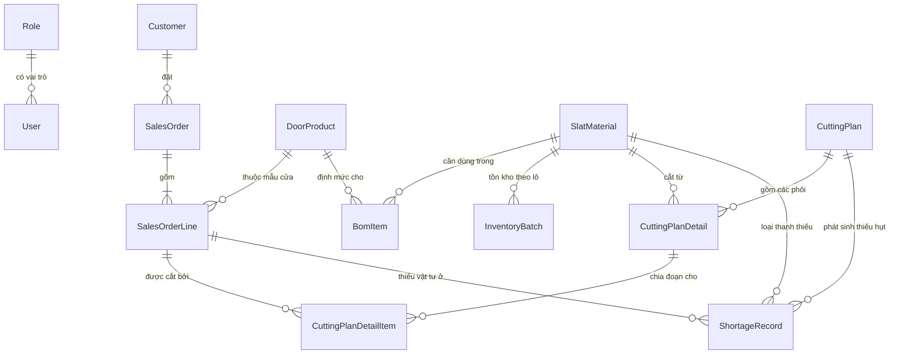
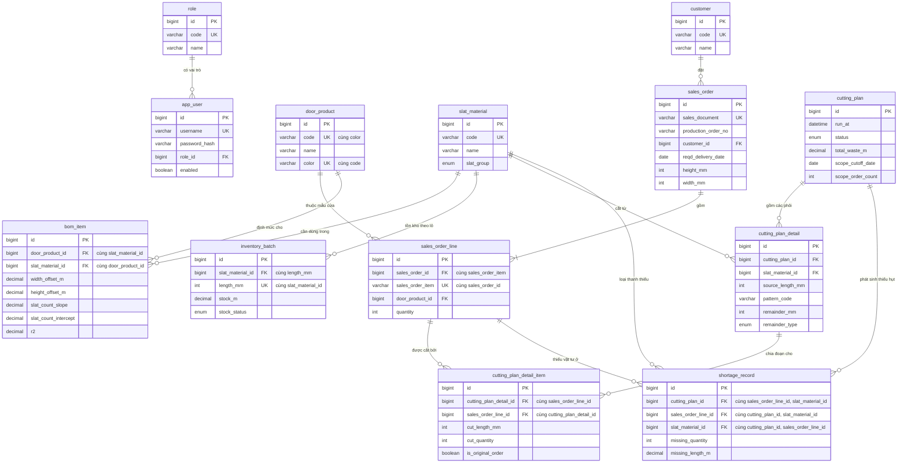

# 3.3.1 Mô hình domain (danh sách entity & quan hệ)

Mục này xác định danh sách entity nghiệp vụ và quan hệ giữa chúng ở mức khái niệm, trước khi ánh xạ sang bảng MySQL cụ thể (kiểu dữ liệu, khóa, chỉ mục) ở mục 3.3.2. Các entity được tổng hợp từ ba nguồn dữ liệu thật đã phân tích (`bom_dinh_muc`, `ton_kho_thanh_nan`, `don_hang`), generic hóa để không phụ thuộc cấu trúc file Excel gốc của doanh nghiệp.

## Danh sách entity

| Entity | Vai trò | Trường chính |
|---|---|---|
| `Role` | Vai trò tài khoản (ADMIN, PLANNER) | `code`, `name` |
| `User` | Tài khoản đăng nhập | `username`, `passwordHash`, `roleId` |
| `Customer` | Khách hàng đặt đơn | `code` (`customer`), `name` (`customer_name`) |
| `DoorProduct` | Mẫu cửa + màu cụ thể | `code` (`material`), `name` (`door_material_name`), `color` (`z_mau_sac`) |
| `SlatMaterial` | Loại thanh nan | `code` (`slat_material`), `name`, `group` (Nan chính/Nan phụ/Thanh đáy/Ray) |
| `BomItem` | Định mức: 1 `DoorProduct` cần bao nhiêu đoạn của 1 `SlatMaterial`, theo công thức từ cao×rộng | `widthOffsetM`, `heightOffsetM`, `slatCountSlope`, `slatCountIntercept`, `r2` |
| `InventoryBatch` | Một lô tồn kho: 1 `SlatMaterial` ở 1 độ dài chuẩn, còn bao nhiêu mét | `lengthMm`, `stockM`, `stockStatus` |
| `SalesOrder` | Đơn hàng khách (đơn vị ưu tiên cắt) | `salesDocument` (khóa nghiệp vụ, so_number), `productionOrderNo` (order/ycsx, chỉ để truy vết), `reqdDeliveryDate`, `heightMm`, `widthMm` |
| `SalesOrderLine` | Dòng chi tiết đơn — 1 mẫu cửa/màu, 1 số lượng bộ | `salesOrderItem` (khóa nghiệp vụ), `quantity` |
| `CuttingPlan` | Header 1 lần chạy thuật toán | `runAt`, `status`, `totalWasteM`, `scopeCutoffDate`, `scopeOrderCount` |
| `CuttingPlanDetail` | 1 phôi tồn kho vật lý đã dùng trong 1 lần chạy, kèm pattern cắt | `patternCode`, `remainderMm`, `remainderType` (DISCARD/RESTOCK/WASTE) |
| `CuttingPlanDetailItem` | Bảng nối: 1 phôi (`CuttingPlanDetail`) phục vụ 1 `SalesOrderLine`, có thể nhiều dòng/phôi | `cutLengthMm`, `cutQuantity`, `isOriginalOrder` |
| `ShortageRecord` | Ghi nhận thiếu vật tư cho 1 `SlatMaterial` của 1 `SalesOrderLine` trong 1 lần chạy | `missingQuantity`, `missingLengthM` |

## Quan hệ giữa các entity

Ba điểm cần lưu ý, đều xuất phát từ việc đối chiếu với báo cáo thật PLANNER đang dùng, chứ không phải phác thảo domain model ban đầu:

**1. `CuttingPlanDetail` — `SalesOrderLine` là quan hệ N-N, qua `CuttingPlanDetailItem`, không phải 1-1.** Ở Mức 2 (cắt bội số) và Mức 3 (ghép nối) của thuật toán, một phôi tồn kho có thể đồng thời phục vụ nhiều đơn hàng khác nhau — báo cáo mức chi tiết nhất (xuất kho theo phôi) cần thể hiện rõ **đơn hàng gốc** và **đơn hàng ghép thêm** dùng chung phôi đó. `CuttingPlanDetailItem` là bảng nối mang cờ `isOriginalOrder` để phân biệt hai vai trò này khi hiển thị, cùng `cutLengthMm`/`cutQuantity` cho biết đoạn cắt cụ thể của đơn đó trên phôi.

**2. `CuttingDemand` không phải là entity được lưu trữ.** Nhu cầu cắt (tổ hợp `slatMaterial`, `cutLength`, `quantity`, `dueDate`, `soNumber` — sinh từ `SalesOrderLine` × `BomItem`) chỉ là đối tượng tạm thời, tính lại mỗi lần chạy thuật toán, không cần bảng riêng: một khi đã có kết quả, nó được phản ánh đầy đủ qua `CuttingPlanDetailItem` (nếu cắt được) hoặc `ShortageRecord` (nếu thiếu vật tư). Lưu `CuttingDemand` như 1 entity sẽ tạo dữ liệu trùng lặp, không có giá trị tra cứu riêng.

**3. Không cần cột trạng thái riêng cho "đơn thuộc nhóm 99".** Theo thuật toán (`docs/sequence-diagrams.md`, luồng sinh phương án cắt), phạm vi mỗi lần chạy được xác định **động** tại thời điểm chạy (`reqd_delivery_date <= t+3` và đơn "chưa được cắt"), không phải một trạng thái cố định gán sẵn cho đơn hàng. "Chưa được cắt" được suy ra trực tiếp từ việc `SalesOrder` đó **chưa có `CuttingPlanDetailItem`/`ShortageRecord` nào tham chiếu tới** — tức đơn chưa từng được đưa vào bất kỳ lần chạy nào. Một khi đơn đã được đưa vào 1 lần chạy (dù kết quả là đủ toàn phần, đủ từng phần, hay thiếu vật tư ở một số dòng), đơn đó được coi là đã xử lý xong và không được thuật toán tự động đưa lại vào lần chạy sau — đúng với phạm vi khóa luận (việc bổ sung vật tư thiếu là việc của hệ thống lập kế hoạch sản xuất ở giai đoạn sau, không phải việc tự động re-queue của thuật toán này). Vì vậy "nhóm 99" chỉ là cách gọi nghiệp vụ cho tập đơn **chưa có bản ghi kết quả nào** tại một thời điểm — không cần persist thành cột riêng, tránh rủi ro cột trạng thái bị lệch với dữ liệu thật (stale state).

## Ghi chú khác

- **"Đợt cắt" (đợt rút vật tư)** ở báo cáo mức tổng quan — nhóm theo `DoorProduct` (mẫu cửa + màu), tối đa 7 bộ/đợt — **không phải một entity riêng**. Đây là kết quả tính toán tại thời điểm hiển thị/xuất báo cáo (group theo `DoorProduct` trên tập `CuttingPlanDetailItem`/`SalesOrderLine` của 1 `CuttingPlan`, sắp theo `reqd_delivery_date`), suy ra hoàn toàn từ dữ liệu đã có, nên không cần bảng lưu trữ riêng — tránh phải đồng bộ lại nếu logic nhóm đợt cắt thay đổi sau này.
- `Role` giữ là bảng riêng (không phải enum trên `User`) để mở khả năng bổ sung vai trò mới sau khóa luận mà không cần đổi schema, dù ở phạm vi MVP chỉ có đúng 2 giá trị (ADMIN, PLANNER).
- `BomItem` về bản chất là bảng nối N-N giữa `DoorProduct` và `SlatMaterial`, mang thêm các thuộc tính công thức (offset, hệ số hồi quy số lượng đoạn) — không cần bảng nối trung gian nào khác.

# 3.3.2 Ánh xạ sang bảng MySQL (ERD chi tiết)

Mục này ánh xạ các entity ở mục 3.3.1 sang bảng MySQL cụ thể: tên bảng, kiểu dữ liệu cột, khóa chính/khóa ngoại, ràng buộc UNIQUE và chỉ mục.

## Quy ước chung

- **Khóa chính**: mọi bảng dùng `id BIGINT AUTO_INCREMENT PRIMARY KEY` (chiến lược `GenerationType.IDENTITY` của Spring Data JPA), không dùng khóa nghiệp vụ (`sales_document`, `code`,...) làm khóa chính trực tiếp — các trường này vẫn được đánh UNIQUE để đảm bảo tính duy nhất, nhưng để khóa chính là số nguyên tự tăng giúp khóa ngoại ở bảng con nhẹ hơn và không bị ảnh hưởng nếu định dạng khóa nghiệp vụ thay đổi.
- **Đơn vị độ dài**: trường tên kết thúc bằng `Mm` (mm, ví dụ `lengthMm`, `cutLengthMm`) lưu số nguyên (`INT`) — dùng cho các phép tính cắt cần chính xác tuyệt đối, tránh sai số dấu phẩy động khi cộng trừ nhiều đoạn. Trường kết thúc bằng `M` (mét, ví dụ `stockM`, `totalWasteM`) là số liệu tổng hợp/báo cáo, lưu `DECIMAL(10,2)`.
- **Tên bảng/cột trùng từ khóa dự trữ của MySQL**: entity `User` ánh xạ sang bảng `app_user` (`USER` là từ khóa dự trữ trong MySQL 8); trường `group` của `SlatMaterial` ánh xạ sang cột `slat_group` (tránh trùng `GROUP BY`).
- **Timestamp**: bảng dữ liệu nền tảng/nghiệp vụ có thể chỉnh sửa qua thời gian (Nhóm 1, Nhóm 2 yêu cầu chức năng) có thêm `created_at`, `updated_at DATETIME`. Bảng lưu kết quả một lần chạy thuật toán (`cutting_plan` và các bảng con) không cần `updated_at` vì chỉ ghi một lần, không có luồng chỉnh sửa sau đó.
- **Naming**: tên bảng/cột theo `snake_case`, tự động từ tên entity/field `camelCase` qua naming strategy mặc định của Spring Boot (Hibernate `SpringPhysicalNamingStrategy`).

## Sơ đồ ERD chi tiết

Sơ đồ dưới đây thể hiện đúng 12 bảng vật lý và các khóa ngoại tương ứng — cùng bộ quan hệ như sơ đồ khái niệm ở 3.3.1, nay gắn với tên bảng/cột thật và đánh dấu khóa chính (PK), khóa ngoại (FK), khóa duy nhất (UK).

Chú thích `"cùng ..."` trên một cột đánh dấu UK/FK nghĩa là ràng buộc UNIQUE hoặc mục đích của khóa ngoại đó là **composite** (nhiều cột cộng lại), mermaid không có ký hiệu riêng cho UNIQUE nhiều cột nên ghi chú trực tiếp bên cạnh — ví dụ `door_product.code` + `door_product.color` là một UNIQUE tổ hợp (không phải hai UNIQUE riêng lẻ).

## Bảng dữ liệu nền tảng

### `role`
| Cột | Kiểu | Ràng buộc |
|---|---|---|
| id | BIGINT | PK |
| code | VARCHAR(20) | NOT NULL, UNIQUE |
| name | VARCHAR(100) | NOT NULL |

### `app_user`
| Cột | Kiểu | Ràng buộc |
|---|---|---|
| id | BIGINT | PK |
| username | VARCHAR(50) | NOT NULL, UNIQUE |
| password_hash | VARCHAR(255) | NOT NULL |
| role_id | BIGINT | NOT NULL, FK → `role.id` |
| enabled | BOOLEAN | NOT NULL, DEFAULT TRUE |
| created_at / updated_at | DATETIME | NOT NULL |

`enabled` bổ sung so với danh sách trường chính ở 3.3.1, phục vụ đúng yêu cầu "ADMIN khóa tài khoản PLANNER" ở Nhóm 4 — khóa tài khoản là đổi cờ, không xóa bản ghi.

### `customer`
| Cột | Kiểu | Ràng buộc |
|---|---|---|
| id | BIGINT | PK |
| code | VARCHAR(50) | NOT NULL, UNIQUE |
| name | VARCHAR(255) | NOT NULL |
| created_at / updated_at | DATETIME | NOT NULL |

### `door_product`
| Cột | Kiểu | Ràng buộc |
|---|---|---|
| id | BIGINT | PK |
| code | VARCHAR(50) | NOT NULL |
| name | VARCHAR(255) | NOT NULL |
| color | VARCHAR(50) | NOT NULL |
| created_at / updated_at | DATETIME | NOT NULL |

UNIQUE (`code`, `color`): một mẫu cửa (`code` = `material`) tồn tại ở nhiều màu khác nhau, mỗi tổ hợp mẫu+màu là một `DoorProduct` riêng — khớp vai trò "mẫu cửa + màu cụ thể" đã ghi ở 3.3.1.

### `slat_material`
| Cột | Kiểu | Ràng buộc |
|---|---|---|
| id | BIGINT | PK |
| code | VARCHAR(50) | NOT NULL, UNIQUE |
| name | VARCHAR(255) | NOT NULL |
| slat_group | ENUM('MAIN_SLAT','SUB_SLAT','BOTTOM_BAR','RAIL') | NOT NULL |
| created_at / updated_at | DATETIME | NOT NULL |

### `bom_item`
| Cột | Kiểu | Ràng buộc |
|---|---|---|
| id | BIGINT | PK |
| door_product_id | BIGINT | NOT NULL, FK → `door_product.id` |
| slat_material_id | BIGINT | NOT NULL, FK → `slat_material.id` |
| width_offset_m | DECIMAL(6,3) | NOT NULL |
| height_offset_m | DECIMAL(6,3) | NOT NULL |
| slat_count_slope | DECIMAL(10,6) | NOT NULL |
| slat_count_intercept | DECIMAL(10,4) | NOT NULL |
| r2 | DECIMAL(5,4) | NULL |
| created_at / updated_at | DATETIME | NOT NULL |

UNIQUE (`door_product_id`, `slat_material_id`): mỗi tổ hợp mẫu cửa × loại thanh chỉ có đúng một công thức định mức hiện hành (ADMIN sửa đè khi cập nhật, không cộng dồn nhiều dòng). `r2` cho phép NULL vì chỉ mang tính tham khảo chất lượng hồi quy khi nhập, không dùng trong phép tính khi sinh phương án cắt.

### `inventory_batch`
| Cột | Kiểu | Ràng buộc |
|---|---|---|
| id | BIGINT | PK |
| slat_material_id | BIGINT | NOT NULL, FK → `slat_material.id` |
| length_mm | INT | NOT NULL |
| stock_m | DECIMAL(10,2) | NOT NULL, DEFAULT 0 |
| stock_status | ENUM('AVAILABLE','DEPLETED') | NOT NULL, DEFAULT 'AVAILABLE' |
| created_at / updated_at | DATETIME | NOT NULL |

UNIQUE (`slat_material_id`, `length_mm`): mỗi tổ hợp loại thanh + độ dài chỉ có một dòng tồn kho hiện tại — nhập Excel hoặc cập nhật thủ công đều là upsert cộng/trừ vào `stock_m` của dòng tương ứng, kể cả khi thuật toán "nhập lại kho" phần dư > 3m ở Mức 4 (cộng thêm vào đúng độ dài đó) — không tạo dòng lịch sử riêng cho mỗi lượt nhập/xuất, khớp cách `SalesOrder` được mô tả ở Nhóm 1 yêu cầu chức năng (cập nhật, không nhân bản). `stock_status` suy ra từ `stock_m` (`DEPLETED` khi về 0) nhưng lưu thành cột thật để lập chỉ mục lọc nhanh — thuật toán chỉ cần tải các lô `AVAILABLE` vào `InventoryPool`; giữ lại lô đã cạn để tra cứu lịch sử thay vì xóa hẳn dòng.

`INDEX (slat_material_id, stock_status)`: phục vụ đúng truy vấn `InventoryPool.load()` ở luồng sinh phương án cắt (`docs/sequence-diagrams.md`).

## Bảng nghiệp vụ đơn hàng

### `sales_order`
| Cột | Kiểu | Ràng buộc |
|---|---|---|
| id | BIGINT | PK |
| sales_document | VARCHAR(50) | NOT NULL, UNIQUE |
| production_order_no | VARCHAR(50) | NULL |
| customer_id | BIGINT | NOT NULL, FK → `customer.id` |
| reqd_delivery_date | DATE | NOT NULL |
| height_mm | INT | NOT NULL |
| width_mm | INT | NOT NULL |
| created_at / updated_at | DATETIME | NOT NULL |

`INDEX (reqd_delivery_date)`: cột được lọc (`<= t+3`) và sắp xếp ưu tiên ở mọi lần sinh phương án cắt — cần chỉ mục riêng để truy vấn phạm vi đợt xử lý không phải quét toàn bảng khi số đơn hàng lịch sử tăng dần theo thời gian.

### `sales_order_line`
| Cột | Kiểu | Ràng buộc |
|---|---|---|
| id | BIGINT | PK |
| sales_order_id | BIGINT | NOT NULL, FK → `sales_order.id` |
| sales_order_item | VARCHAR(20) | NOT NULL |
| door_product_id | BIGINT | NOT NULL, FK → `door_product.id` |
| quantity | INT | NOT NULL |
| created_at / updated_at | DATETIME | NOT NULL |

UNIQUE (`sales_order_id`, `sales_order_item`): khóa nghiệp vụ dòng chi tiết là tổ hợp mã đơn + số thứ tự dòng (`item`) từ hệ thống nguồn.

## Bảng kết quả phương án cắt

### `cutting_plan`
| Cột | Kiểu | Ràng buộc |
|---|---|---|
| id | BIGINT | PK |
| run_at | DATETIME | NOT NULL |
| status | ENUM('COMPLETED','FAILED') | NOT NULL, DEFAULT 'COMPLETED' |
| total_waste_m | DECIMAL(10,2) | NOT NULL |
| scope_cutoff_date | DATE | NOT NULL |
| scope_order_count | INT | NOT NULL |

Không có `updated_at`: một `CuttingPlan` và toàn bộ bảng con được ghi trong đúng 1 transaction, không có luồng chỉnh sửa sau khi lưu. Giá trị `FAILED` mang tính dự phòng (nếu về sau cần một bước xử lý nhiều giai đoạn có thể thất bại giữa chừng); ở phạm vi khóa luận, transaction rollback khi lỗi thì không có dòng nào được lưu, nên hiện tại chỉ `COMPLETED` được set trong thực tế.

### `cutting_plan_detail`
| Cột | Kiểu | Ràng buộc |
|---|---|---|
| id | BIGINT | PK |
| cutting_plan_id | BIGINT | NOT NULL, FK → `cutting_plan.id` |
| slat_material_id | BIGINT | NOT NULL, FK → `slat_material.id` |
| source_length_mm | INT | NOT NULL |
| pattern_code | VARCHAR(100) | NOT NULL |
| remainder_mm | INT | NOT NULL, DEFAULT 0 |
| remainder_type | ENUM('DISCARD','RESTOCK','WASTE') | NOT NULL |

`INDEX (cutting_plan_id)`.

**Quyết định thiết kế đáng chú ý: không có khóa ngoại tới `inventory_batch`.** `source_length_mm` copy trực tiếp độ dài phôi tồn kho tại thời điểm cắt, không FK, vì `InventoryBatch` là số liệu tổng hợp còn-bao-nhiêu-mét luôn thay đổi theo thời gian (bị trừ dần trong lúc thuật toán chạy, được cộng thêm khi nhập lại kho phần dư > 3m ở Mức 4) — nếu giữ FK tới đúng dòng `inventory_batch`, lịch sử phương án cắt cũ sẽ bị ảnh hưởng khi dòng đó sau này thay đổi số liệu. Copy giá trị giữ lịch sử phương án cắt bất biến, đúng yêu cầu phi chức năng "kết quả tái lập được".

### `cutting_plan_detail_item`
| Cột | Kiểu | Ràng buộc |
|---|---|---|
| id | BIGINT | PK |
| cutting_plan_detail_id | BIGINT | NOT NULL, FK → `cutting_plan_detail.id` |
| sales_order_line_id | BIGINT | NOT NULL, FK → `sales_order_line.id` |
| cut_length_mm | INT | NOT NULL |
| cut_quantity | INT | NOT NULL |
| is_original_order | BOOLEAN | NOT NULL |

UNIQUE (`cutting_plan_detail_id`, `sales_order_line_id`): một dòng đơn hàng chỉ xuất hiện đúng 1 lần trên 1 phôi cụ thể (nhiều đoạn của cùng dòng đơn trên cùng phôi gộp vào `cut_quantity`, không tách nhiều dòng). `INDEX (sales_order_line_id)` phục vụ truy vấn suy ra trạng thái "đã xử lý" của một `SalesOrder` (điểm 3, mục 3.3.1): kiểm tra tồn tại bản ghi tham chiếu tới các `SalesOrderLine` của đơn đó.

### `shortage_record`
| Cột | Kiểu | Ràng buộc |
|---|---|---|
| id | BIGINT | PK |
| cutting_plan_id | BIGINT | NOT NULL, FK → `cutting_plan.id` |
| sales_order_line_id | BIGINT | NOT NULL, FK → `sales_order_line.id` |
| slat_material_id | BIGINT | NOT NULL, FK → `slat_material.id` |
| missing_quantity | INT | NOT NULL |
| missing_length_m | DECIMAL(10,2) | NOT NULL |

UNIQUE (`cutting_plan_id`, `sales_order_line_id`, `slat_material_id`): trong 1 lần chạy, một dòng đơn hàng chỉ thiếu đúng 1 lần cho 1 loại thanh nan cụ thể. `INDEX (sales_order_line_id)` dùng cho cùng mục đích suy ra trạng thái xử lý như ở `cutting_plan_detail_item`.
