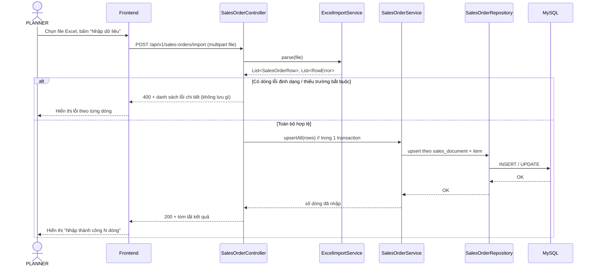
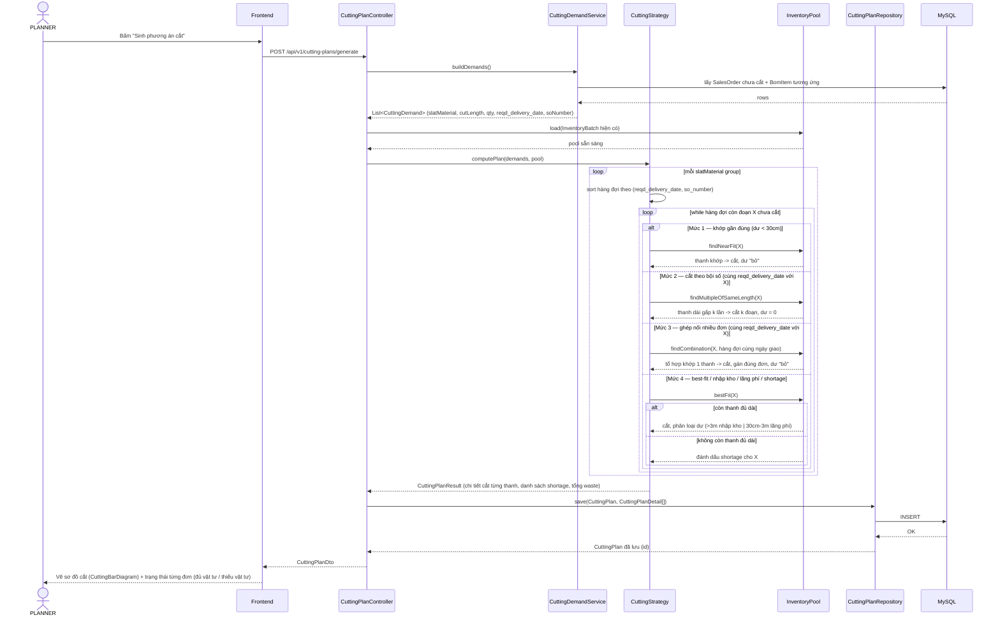
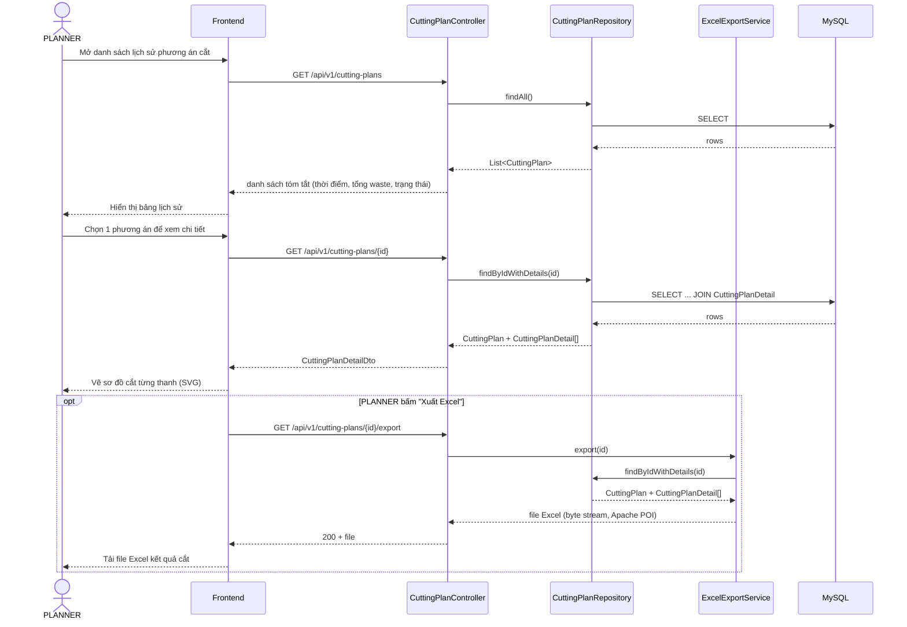

# 3.4 Sequence diagram các luồng nghiệp vụ chính

## 1. Luồng nhập dữ liệu từ Excel

Áp dụng chung cho cả 3 loại dữ liệu (đơn hàng, tồn kho, định mức BOM) — minh họa bằng luồng nhập đơn hàng. Toàn bộ lượt nhập được xử lý trong 1 transaction: nếu có dòng lỗi, hủy toàn bộ và trả lỗi chi tiết (đúng yêu cầu phi chức năng "tính toàn vẹn khi nhập liệu" ở `docs/requirements-functional.md`).

## 2. Luồng sinh phương án cắt (luồng lõi)

Luồng quan trọng nhất của khóa luận — thể hiện đúng 4 mức ưu tiên đã chốt (`.claude/PLAN.md` mục 3.4.4): khớp gần đúng → cắt theo bội số (cùng ngày giao) → ghép nối nhiều đơn (cùng ngày giao) → best-fit/nhập kho/shortage.

## 3. Luồng xem / xuất kết quả phương án cắt

