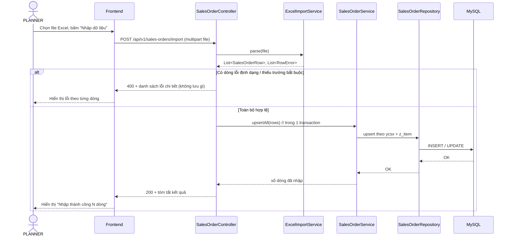
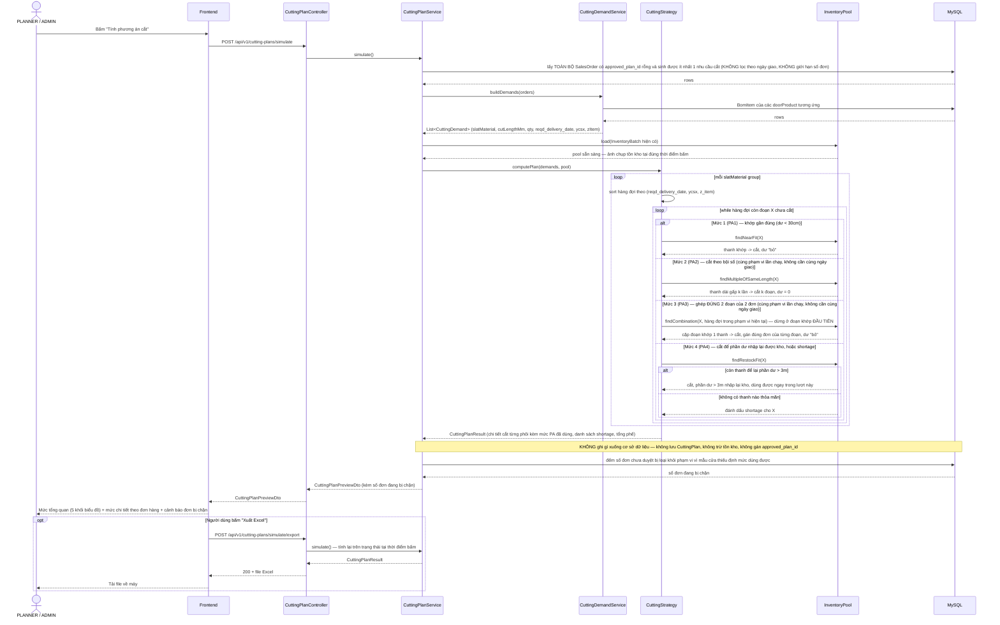
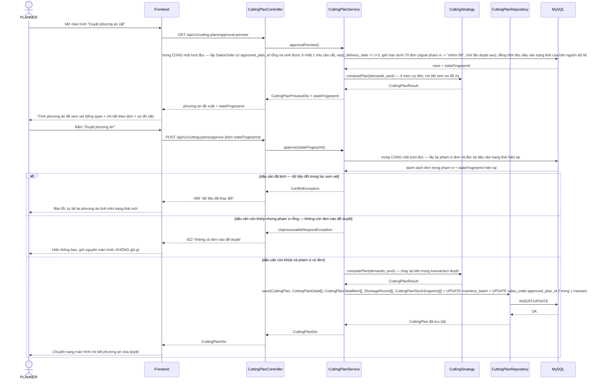
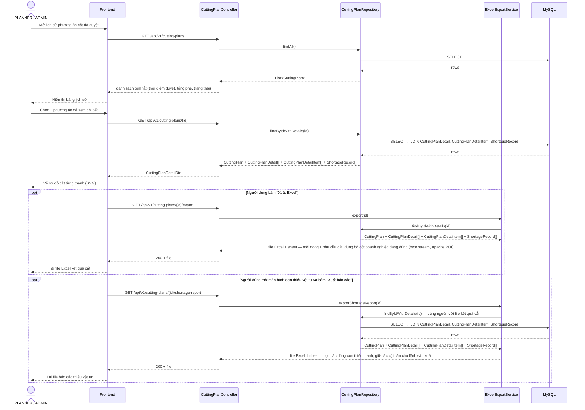

# 3.4 Sequence diagram các luồng nghiệp vụ chính

## 1. Luồng nhập dữ liệu từ Excel

Áp dụng chung cho cả 3 loại dữ liệu (đơn hàng, tồn kho, định mức BOM) — minh họa bằng luồng nhập đơn hàng. Toàn bộ lượt nhập được xử lý trong 1 transaction: nếu có dòng lỗi, hủy toàn bộ và trả lỗi chi tiết (đúng yêu cầu phi chức năng "tính toàn vẹn khi nhập liệu" ở `docs/requirements-functional.md`).



Riêng với đơn hàng, vòng lặp upsert bỏ qua những bộ cửa đã thuộc một phương án cắt được duyệt: bản ghi cũ giữ nguyên, và nếu dữ liệu trong file nguồn khác với dữ liệu đã lưu thì lượt nhập trả thêm một danh sách cảnh báo nêu rõ bộ cửa nào và trường nào khác. Cảnh báo không hủy lượt nhập — các dòng còn lại vẫn được lưu bình thường.

Kết quả của luồng luôn thuộc đúng một trong hai trường hợp: nếu phát hiện bất kỳ dòng lỗi nào, không bản ghi nào được lưu và người thực hiện (PLANNER với đơn hàng/tồn kho, ADMIN với định mức BOM) phải sửa lại file nguồn rồi nhập lại từ đầu; nếu toàn bộ dữ liệu hợp lệ, mọi bản ghi được lưu trong đúng một giao dịch và sẵn sàng phục vụ ngay cho các luồng tiếp theo — đơn hàng và định mức BOM phục vụ bước sinh nhu cầu cắt, tồn kho phục vụ `InventoryPool` ở luồng "2. Luồng tính và duyệt phương án cắt" bên dưới.

## 2. Luồng tính và duyệt phương án cắt (luồng lõi)

Đây là luồng quan trọng nhất của khóa luận, và nó có hai cửa vào khác nhau. **Tính phương án cắt** chạy trên toàn bộ đơn hàng chưa duyệt để thấy trước tình trạng đáp ứng vật tư, không chạm vào dữ liệu. **Duyệt phương án cắt** chạy trên tập đơn đã giới hạn theo quy tắc t+3 ngày/dưới 70 đơn, và là nơi duy nhất ghi dữ liệu xuống hệ thống. Hai luồng dùng chung đúng một thuật toán — 4 mức ưu tiên đã chốt: khớp gần đúng → cắt theo bội số (cùng phạm vi lần chạy) → ghép đúng 2 đoạn của 2 đơn (cùng phạm vi lần chạy, lấy đoạn khớp đầu tiên) → cắt để phần dư nhập lại được kho (trên 3m), hết cách thì báo thiếu vật tư — nên phần `computePlan` chỉ được vẽ chi tiết một lần ở sơ đồ 2a.

### 2a. Tính phương án cắt (không thay đổi dữ liệu)



Nút xuất Excel **tính lại** thay vì dùng lại kết quả của lần bấm trước. Đây là hệ quả trực tiếp của việc không lưu lịch sử: không có bản ghi nào để đọc lại. Đổi lại, file xuất ra luôn phản ánh trạng thái tại thời điểm bấm xuất, đúng tinh thần "mỗi lần bấm là một lần tính trên trạng thái hiện tại" — và vì thuật toán cho kết quả tái lập được với cùng một bộ dữ liệu đầu vào (yêu cầu phi chức năng về tính đúng đắn), file vẫn khớp với những gì màn hình đang hiển thị chừng nào dữ liệu chưa đổi.

### 2b. Duyệt phương án cắt (nơi duy nhất ghi dữ liệu)



Thuật toán được chạy **hai lần** trong luồng duyệt: một lần lúc trình phương án cho PLANNER xem, một lần nữa bên trong transaction duyệt. Đây không phải lãng phí mà là điều kiện để phương án ghi xuống luôn khớp dữ liệu thật: nhận lại một kết quả đã tính sẵn từ phía người dùng là tin vào đúng thứ đang phải kiểm. Chạy lại bên trong transaction duyệt thì phương án được tính từ chính dữ liệu mà transaction đó đọc được, còn dấu vân đảm bảo dữ liệu đó vẫn là dữ liệu PLANNER đã nhìn thấy. Hai cơ chế này bổ sung cho nhau chứ không thay nhau, và cũng không thay được khóa dòng: hai lượt duyệt chạy song song cùng đọc được dấu vân cũ thì cả hai đều vượt qua được ô kiểm (xem `docs/activity-diagrams.md` mục 3.1).

Khối `alt` có ba nhánh chứ không phải hai, và thứ tự giữa chúng là cố ý: **dấu vân được kiểm trước, phạm vi rỗng kiểm sau**. Dấu vân lệch nghĩa là dữ liệu nền đã đổi — lúc đó con số "phạm vi có bao nhiêu đơn" vừa đọc được cũng không còn là con số PLANNER đã nhìn thấy, nên báo "dữ liệu đã thay đổi" mới là mô tả đúng chuyện vừa xảy ra. Hai nhánh từ chối dùng **hai mã trạng thái khác nhau** vì giao diện phải phản ứng khác nhau: 409 kéo theo việc tính lại phương án trên trạng thái mới (bấm lại bằng dấu vân cũ thì lần nào cũng hỏng), còn 422 thì tính lại hoàn toàn vô ích — không có đơn nào thì tính bao nhiêu lần cũng vẫn không có, nên chỉ hiện một thông báo và giữ nguyên màn hình. Gộp chung một mã sẽ buộc giao diện đoán ý nghĩa qua nội dung câu thông báo.

Bốn thứ được ghi trong cùng một transaction, không tách rời được: kết quả cắt (`CuttingPlan` + 3 bảng con), ảnh chụp tồn kho tại thời điểm bắt đầu lần chạy, số thanh tồn kho bị trừ và phần dư trên 3m được nhập lại, và `approved_plan_id` của **mọi** đơn trong phạm vi. Nếu tách, hệ thống có thể rơi vào trạng thái nửa vời nguy hiểm — ví dụ tồn kho đã bị trừ nhưng đơn vẫn nằm trong hàng chờ, khiến lần duyệt sau cắt lại chính những đơn đó trên một kho đã cạn.

Kết thúc luồng, hệ thống trả về đồng thời hai loại kết quả gắn theo từng loại thanh nan trong mỗi đơn hàng, không phải theo cả đơn: `CuttingPlanDetailItem` (phương án cắt cụ thể — dùng thanh tồn kho nào, cắt thành đoạn nào, phần dư xử lý ra sao) cho những loại thanh đã cắt được, và `ShortageRecord` (loại thanh nan, số lượng/độ dài còn thiếu) cho những loại thanh bị cạn kho. Một đơn hàng hoàn toàn có thể vừa có `CuttingPlanDetailItem` cho loại thanh đủ tồn kho, vừa có `ShortageRecord` cho loại thanh khác bị thiếu — trường hợp này vẫn được tính là "thiếu vật tư" ở mức tổng quan (đúng công thức đã chốt ở `docs/domain-model.md` mục 3.3.1), dù đơn đó đã có một phần phương án cắt cụ thể. Việc trừ/cộng tồn kho (`inventory_batch.so_thanh`) nằm trong đúng 1 transaction với việc lưu `CuttingPlan` vừa đảm bảo không có trạng thái nửa-lưu nếu có lỗi giữa chừng, vừa giữ đúng nguyên tắc "cân bằng vật liệu" — yêu cầu phi chức năng quan trọng nhất của hệ thống (tổng độ dài đã cắt cộng mọi loại phần dư phải bằng đúng tổng độ dài tồn kho đã dùng).

### Công thức tính nhu cầu cắt (`CuttingDemandService.buildDemands()`)

Bước `SVC->>DS: buildDemands(orders)` ở trên sinh ra `CuttingDemand` cho từng cặp (`SalesOrder`, `BomItem` của `doorProductId` tương ứng) theo công thức đã xác nhận với PLANNER (nguồn gốc từ view nội bộ `v_door_slats_norm` → `v_mps_kc04_slats_demand` mà doanh nghiệp đang dùng). Gọi `doorAreaM2 = zChieuCaoDh × zChieuRongDh`, `slatGroup = bomItem.slatMaterial.slatGroup` (tra qua quan hệ `BomItem → SlatMaterial`, không phải cột riêng trên `BomItem`):

**Bước 1 — Chiều rộng sản xuất** (dùng cho Nan chính):
```
productionWidthM = zChieuRongDh - widthOffsetM
    (fallback nếu widthOffsetM NULL: zChieuRongDh × 0.976)
```

**Bước 2 — `cutDimM`** (chiều dài phôi cần cắt cho 1 thanh), khác nhau theo `slatGroup`:

| `slatGroup` | `cutDimM` |
|---|---|
| MAIN_SLAT (Nan chính) | `productionWidthM` (= `zChieuRongDh - widthOffsetM`) |
| BOTTOM_BAR, SUB_SLAT (Thanh đáy, Nan phụ) | `zChieuRongDh` (đúng bằng chiều rộng cửa, không trừ offset nào) |
| RAIL (Ray) | `zChieuCaoDh - heightOffsetM` |
| OTHER (Khác) | không xác định theo nhóm — luôn rơi vào fallback toàn phần ở Bước 4 |

> **Đã xác nhận lại trực tiếp với doanh nghiệp**: chỉ **Nan chính** mới áp dụng offset chiều rộng, chỉ **Ray** mới áp dụng offset chiều cao — Thanh đáy/Nan phụ không áp dụng offset nào (khác với phiên bản thiết kế trước, vốn suy luận ngược lại thuần túy từ số liệu thống kê lúc chưa có xác nhận từ phía công ty).

**Bước 3 — `requiredPieces`** (số lượng thanh cần), khác nhau theo `slatGroup`:

| `slatGroup` | `requiredPieces` |
|---|---|
| MAIN_SLAT | `ROUND(slatCountSlope × zChieuCaoDh + slatCountIntercept)` — hệ số `slatCountSlope`/`slatCountIntercept` do đội kỹ thuật cung cấp trực tiếp, dùng thẳng không qua ngưỡng tin cậy nào |
| BOTTOM_BAR, SUB_SLAT | luôn = 1 |
| RAIL | luôn = 2 |
| OTHER | không xác định theo nhóm |

> **Đã xác nhận lại trực tiếp với doanh nghiệp (hướng đi chính thức)**: định mức BOM (offset, hệ số `slatCountSlope`/`slatCountIntercept`) do đội kỹ thuật cung cấp trực tiếp thành thông số cố định, **không phải suy luận bằng hồi quy thống kê từ dữ liệu lịch sử** như bản thiết kế trước (từng có thêm bước kiểm tra độ tin cậy `slatCountR2 >= 0.5` và một công thức fallback riêng cho Nan chính dựa trên `dinhMucMPerM2`) — 2 cơ chế đó đã bị loại bỏ hoàn toàn, không còn `slatCountR2`/`dinhMucMPerM2` trong schema (xem `docs/domain-model.md` mục `bom_item`).

**Bước 4 — Fallback toàn phần**: khi `slatGroup = OTHER`, hoặc khi một `BomItem` cụ thể **chưa được đội kỹ thuật cung cấp công thức cắt riêng** (thiếu offset/hệ số cần thiết để tính `cutDimM`/`requiredPieces` ở trên), hệ thống **không tự suy ra được độ dài đoạn cần cắt** — chỉ có tổng độ dài ước tính `= dinhMucTbMPerBoCua` (mét/bộ cửa). Vì thuật toán cắt 1D cần biết độ dài từng đoạn cụ thể (không chỉ tổng mét), các `BomItem` rơi vào trường hợp này **không sinh được `CuttingDemand` tự động** — cần ghi log cảnh báo và loại khỏi phạm vi thuật toán ở giai đoạn khóa luận này, chờ ADMIN bổ sung công thức riêng (do kỹ thuật cung cấp) nếu phát sinh thực tế (tới nay dữ liệu thật cho thấy đây là thiểu số).

`CuttingDemand.cutLength = cutDimM` (quy đổi mm), `CuttingDemand.quantity = requiredPieces` (không nhân thêm với "số lượng đặt hàng" vì mỗi `SalesOrder` đã luôn là đúng 1 bộ cửa — xem điểm 1, mục 3.3.1).

### Cách sinh hai cột mô tả của báo cáo

Mức chi tiết theo đơn hàng (`docs/requirements-functional.md`) có hai cột không phải số mà là câu chữ, được sinh ra từ `CuttingPlanResult`. Đặc tả cách sinh chúng nằm ở đây vì cả hai đều đọc trực tiếp kết quả thuật toán, không lấy từ bảng nào khác.

**Cột trạng thái đáp ứng** — gộp số thanh cần và số thanh thiếu của một nhu cầu cắt thành một câu đọc được:

| Tình huống | Nội dung |
|---|---|
| Không thiếu thanh nào | `✔Đủ` — giữ nguyên ký tự đánh dấu của khuôn mẫu doanh nghiệp |
| Thiếu một phần | `Thiếu {số thanh thiếu} nan {độ dài đoạn}m ({tổng độ dài thiếu}m)` |
| Thiếu toàn bộ | `Thiếu toàn bộ {số thanh cần} nan {độ dài đoạn}m ({tổng độ dài thiếu}m)` |

**Cột mô tả cách cắt** — mỗi phôi đã dùng cho nhu cầu cắt đó sinh ra một mệnh đề theo khuôn `{độ dài phôi}: {số phôi} phôi → {số nan} nan [{cách xử lý phần dư}, {mức PA}] (còn lại {số phôi cùng loại còn trong kho})`. Phần dư dưới 30cm ghi là cắt phế kèm độ dài bỏ đi; phần dư trên 3m ghi là cắt để lại kèm độ dài nhập lại kho. Phần dư đúng bằng 0 — luôn là trường hợp cắt theo bội số ở PA2 — vẫn ghi theo khuôn cắt phế với độ dài bằng không, không tách thành một câu chữ riêng: khuôn mẫu báo cáo của doanh nghiệp viết như vậy, và mệnh đề đọc được nhất quán khi mọi phôi đều nêu tường minh phần dư của nó thay vì bắt người đọc suy ra từ sự vắng mặt của một con số. Phôi nguồn vốn là một phần dư đã nhập lại kho được đánh dấu riêng để người đọc biết đó là thanh tái sử dụng chứ không phải thanh nguyên. Số phôi còn lại trong kho lấy theo đúng cặp (loại thanh nan, độ dài) sau khi lần chạy kết thúc, và với phương án đã duyệt thì đọc từ giá trị đã lưu cùng phương án chứ không tính lại từ tồn kho hiện hành (xem `docs/domain-model.md`, cột `remaining_sticks_after` và bảng `cutting_plan_stock_snapshot`). Quy tắc làm tròn độ dài trong mọi chuỗi mô tả xem `docs/requirements-functional.md`.

**Mức PA1–PA4** ghi trong cột trên chính là mức ưu tiên mà thuật toán đã dùng cho phôi đó, tương ứng bốn nhánh `alt` ở sơ đồ 2a: PA1 khớp gần đúng, PA2 cắt theo bội số, PA3 ghép nối nhiều đơn, PA4 cắt để lại phần dư nhập kho. Mức này phải được `CuttingStrategy` ghi lại ngay tại nhánh đã cắt và lưu cùng phôi (`cutting_plan_detail.cut_level`, xem `docs/domain-model.md`) — không suy ngược được từ kết quả, vì một phôi cắt ra đúng một đoạn với phần dư dưới 30cm có thể đến từ PA1 hoặc từ PA3 khi tổ hợp ghép chỉ tìm được một đoạn.

Ba nhóm dữ liệu khác mà báo cáo của doanh nghiệp có nhưng hệ thống không có nguồn để tính — số thanh đang bị giữ theo phiếu dự trữ, tồn kho tại một kho vật tư khác, và các lệnh sản xuất thanh nan đang mở chưa nhập kho — để trống, không suy đoán.

## 3. Luồng xem / xuất kết quả phương án cắt

Sau khi đã có ít nhất một phương án được duyệt ở luồng 2b, người dùng dùng luồng này để tra cứu lại lịch sử các lần duyệt, xem chi tiết một phương án cụ thể, và xuất ra Excel để chỉ đạo sản xuất thực tế. Các lần **tính** không để lại bản ghi nào nên không xuất hiện ở đây. Có hai thao tác xuất file, đều tùy chọn: kết quả phương án cắt (đưa xuống xưởng cắt) và báo cáo thiếu vật tư (làm căn cứ sản xuất bù thanh nan). Chúng vẫn là hai endpoint riêng vì phục vụ hai công việc khác nhau, nhưng **đọc chung một nguồn dữ liệu** — báo cáo thiếu vật tư là bản lọc của mức chi tiết theo đơn hàng, giữ các dòng còn thiếu thanh và các cột cần cho việc lập lệnh sản xuất. Nhờ dùng chung nguồn, hai file không thể lệch số với nhau.



Luồng này khép lại vòng đời một phương án cắt đã mở ra ở luồng 2: PLANNER không chỉ chạy thuật toán mà còn cần tra cứu lại, kiểm tra trực quan trên giao diện, và đưa kết quả xuống xưởng sản xuất qua file Excel. `findByIdWithDetails` luôn nạp lại đúng `CuttingPlanDetail`/`CuttingPlanDetailItem`/`ShortageRecord` đã lưu tại thời điểm duyệt, nên xem lại một phương án cũ luôn cho kết quả nhất quán, không bị ảnh hưởng bởi các thay đổi tồn kho phát sinh sau đó — khác hẳn với chức năng tính, nơi mỗi lần bấm cho một kết quả khác vì trạng thái đã đổi. Hai file xuất ra tại hai thời điểm khác nhau vẫn luôn khớp nhau vì cùng đọc một tập dữ liệu đã lưu.
