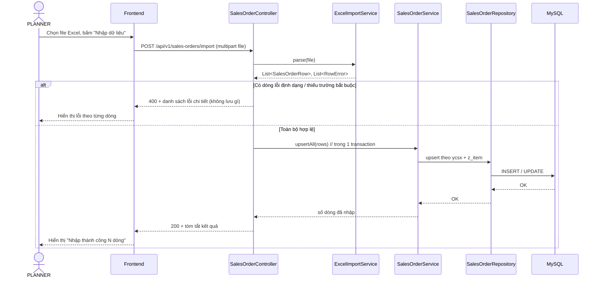
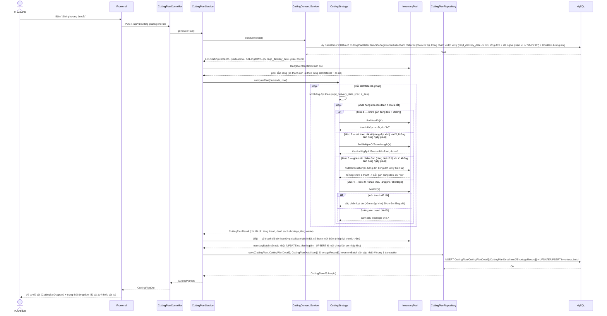
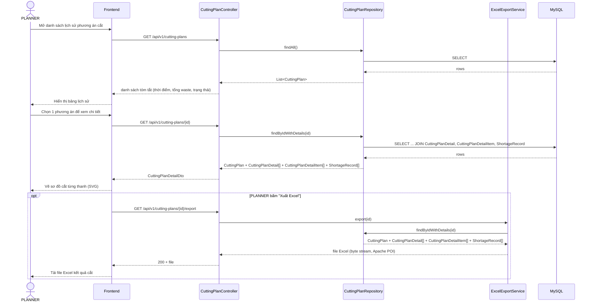

# 3.4 Sequence diagram các luồng nghiệp vụ chính

## 1. Luồng nhập dữ liệu từ Excel

Áp dụng chung cho cả 3 loại dữ liệu (đơn hàng, tồn kho, định mức BOM) — minh họa bằng luồng nhập đơn hàng. Toàn bộ lượt nhập được xử lý trong 1 transaction: nếu có dòng lỗi, hủy toàn bộ và trả lỗi chi tiết (đúng yêu cầu phi chức năng "tính toàn vẹn khi nhập liệu" ở `docs/requirements-functional.md`).



Kết quả của luồng luôn thuộc đúng một trong hai trường hợp: nếu phát hiện bất kỳ dòng lỗi nào, không bản ghi nào được lưu và người thực hiện (PLANNER với đơn hàng/tồn kho, ADMIN với định mức BOM) phải sửa lại file nguồn rồi nhập lại từ đầu; nếu toàn bộ dữ liệu hợp lệ, mọi bản ghi được lưu trong đúng một giao dịch và sẵn sàng phục vụ ngay cho các luồng tiếp theo — đơn hàng và định mức BOM phục vụ bước sinh nhu cầu cắt, tồn kho phục vụ `InventoryPool` ở luồng "2. Luồng sinh phương án cắt" bên dưới.

## 2. Luồng sinh phương án cắt (luồng lõi)

PLANNER kích hoạt luồng này sau khi dữ liệu đơn hàng, tồn kho và định mức BOM (Nhóm 1, Nhóm 2) đã sẵn sàng — từ luồng 1 (nhập Excel) hoặc từ thao tác quản lý thủ công — không cần tự chọn hay lọc trước đơn hàng nào cần xử lý — đây là luồng quan trọng nhất của khóa luận, thể hiện đúng 4 mức ưu tiên đã chốt: khớp gần đúng → cắt theo bội số (cùng đợt xử lý) → ghép nối nhiều đơn (cùng đợt xử lý) → best-fit/nhập kho/shortage.



Kết thúc luồng, hệ thống trả về đồng thời hai loại kết quả gắn theo từng loại thanh nan trong mỗi đơn hàng, không phải theo cả đơn: `CuttingPlanDetailItem` (phương án cắt cụ thể — dùng thanh tồn kho nào, cắt thành đoạn nào, phần dư xử lý ra sao) cho những loại thanh đã cắt được, và `ShortageRecord` (loại thanh nan, số lượng/độ dài còn thiếu) cho những loại thanh bị cạn kho. Một đơn hàng hoàn toàn có thể vừa có `CuttingPlanDetailItem` cho loại thanh đủ tồn kho, vừa có `ShortageRecord` cho loại thanh khác bị thiếu — trường hợp này vẫn được tính là "thiếu vật tư" ở mức tổng quan (đúng công thức đã chốt ở `docs/domain-model.md` mục 3.3.1), dù đơn đó đã có một phần phương án cắt cụ thể. Toàn bộ việc trừ/cộng tồn kho (`inventory_batch.so_thanh`) phải nằm trong đúng 1 transaction với việc lưu `CuttingPlan`, vừa đảm bảo không có trạng thái nửa-lưu nếu có lỗi giữa chừng, vừa giữ đúng nguyên tắc "cân bằng vật liệu" — yêu cầu phi chức năng quan trọng nhất của hệ thống (tổng độ dài đã cắt cộng mọi loại phần dư phải bằng đúng tổng độ dài tồn kho đã dùng).

### Công thức tính nhu cầu cắt (`CuttingDemandService.buildDemands()`)

Bước `DS->>DB: lấy SalesOrder ... + BomItem tương ứng` ở trên sinh ra `CuttingDemand` cho từng cặp (`SalesOrder`, `BomItem` của `doorProductId` tương ứng) theo công thức đã xác nhận với PLANNER (nguồn gốc từ view nội bộ `v_door_slats_norm` → `v_mps_kc04_slats_demand` mà doanh nghiệp đang dùng). Gọi `doorAreaM2 = zChieuCaoDh × zChieuRongDh`, `slatGroup = bomItem.slatMaterial.slatGroup` (tra qua quan hệ `BomItem → SlatMaterial`, không phải cột riêng trên `BomItem`):

**Bước 1 — Chiều rộng sản xuất** (dùng chung cho các nhóm không phải Nan chính):
```
productionWidthM = zChieuRongDh - widthOffsetM
    (fallback nếu widthOffsetM NULL: zChieuRongDh × 0.976)
```

**Bước 2 — `cutDimM`** (chiều dài phôi cần cắt cho 1 thanh), khác nhau theo `slatGroup`:

| `slatGroup` | `cutDimM` |
|---|---|
| MAIN_SLAT (Nan chính) | `zChieuRongDh` (đúng bằng chiều rộng cửa, KHÔNG trừ offset — nan có đột lỗ, phải chừa đầu) |
| BOTTOM_BAR, SUB_SLAT (Thanh đáy, Nan phụ) | `productionWidthM` |
| RAIL (Ray) | `zChieuCaoDh - heightOffsetM` |
| OTHER (Khác) | không xác định theo nhóm — luôn rơi vào fallback toàn phần ở Bước 4 |

**Bước 3 — `requiredPieces`** (số lượng thanh cần), khác nhau theo `slatGroup`:

| `slatGroup` | `requiredPieces` |
|---|---|
| MAIN_SLAT | Ưu tiên `ROUND(slatCountSlope × zChieuCaoDh + slatCountIntercept)` — chỉ dùng khi `slatCountR2 >= 0.5`; nếu không (NULL hoặc < 0.5): fallback `ROUND(doorAreaM2 × dinhMucMPerM2 / zChieuRongDh)` |
| BOTTOM_BAR, SUB_SLAT | luôn = 1 |
| RAIL | luôn = 2 |
| OTHER | không xác định theo nhóm |

**Bước 4 — Fallback toàn phần**: khi `slatGroup = OTHER` hoặc thiếu dữ liệu để tính `cutDimM`/`requiredPieces` ở trên, hệ thống **không tự suy ra được độ dài đoạn cần cắt** — chỉ có tổng độ dài ước tính `= dinhMucTbMPerBoCua` (mét/bộ cửa). Vì thuật toán cắt 1D cần biết độ dài từng đoạn cụ thể (không chỉ tổng mét), các `BomItem` rơi vào trường hợp này **không sinh được `CuttingDemand` tự động** — cần ghi log cảnh báo và loại khỏi phạm vi thuật toán ở giai đoạn khóa luận này, chờ ADMIN bổ sung công thức riêng nếu phát sinh thực tế (tới nay dữ liệu thật cho thấy đây là thiểu số).

`CuttingDemand.cutLength = cutDimM` (quy đổi mm), `CuttingDemand.quantity = requiredPieces` (không nhân thêm với "số lượng đặt hàng" vì mỗi `SalesOrder` đã luôn là đúng 1 bộ cửa — xem điểm 1, mục 3.3.1).

## 3. Luồng xem / xuất kết quả phương án cắt

Sau khi đã có ít nhất một lần chạy ở luồng 2, PLANNER dùng luồng này để tra cứu lại lịch sử các lần chạy, xem chi tiết một phương án cụ thể, và xuất kết quả ra Excel để chỉ đạo sản xuất thực tế. Xuất Excel là bước tùy chọn — PLANNER có thể chỉ xem sơ đồ cắt trên giao diện mà không cần xuất file mỗi lần xem.



Luồng này khép lại vòng đời một lần sinh phương án cắt đã mở ra ở luồng 2: PLANNER không chỉ chạy thuật toán mà còn cần tra cứu lại, kiểm tra trực quan trên giao diện, và đưa kết quả xuống xưởng sản xuất qua file Excel. `findByIdWithDetails` luôn nạp lại đúng `CuttingPlanDetail`/`CuttingPlanDetailItem`/`ShortageRecord` đã lưu tại thời điểm chạy, nên xem lại một phương án cũ luôn cho kết quả nhất quán, không bị ảnh hưởng bởi các thay đổi tồn kho phát sinh sau đó.
