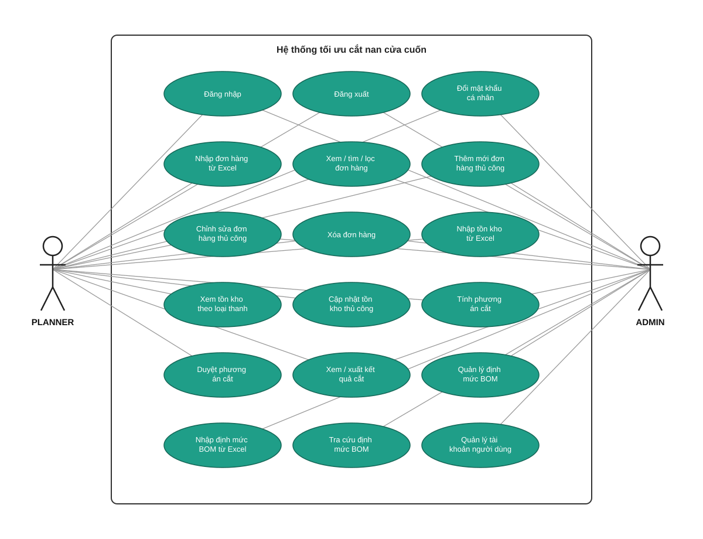

# 3.1.2 Biểu đồ ca sử dụng

Hệ thống có hai tác nhân: **PLANNER** (vận hành nghiệp vụ hằng ngày — đơn hàng, tồn kho, sinh phương án cắt) và **ADMIN** (quản trị dữ liệu nền tảng — định mức BOM, tài khoản người dùng). Hai tác nhân chia sẻ nhóm ca sử dụng chung về tài khoản (đăng nhập, đăng xuất, đổi mật khẩu); phần lớn còn lại tách biệt rõ theo đúng ranh giới trách nhiệm đã phân tích ở mục yêu cầu chức năng — PLANNER không có quyền chỉnh sửa BOM hay quản lý người dùng, ADMIN không trực tiếp vận hành quy trình cắt hằng ngày (nhập đơn hàng hàng loạt từ Excel, chạy thuật toán sinh phương án cắt). Riêng nhóm ca sử dụng thao tác thủ công trên đơn hàng (xem/tìm/lọc, tạo mới, chỉnh sửa, xóa) là ngoại lệ dùng chung — ADMIN có đầy đủ quyền này như PLANNER, vì đây cũng là một phần dữ liệu nền tảng ảnh hưởng đến kết quả cắt mà ADMIN cần có khả năng can thiệp khi cần.

## Ghi chú từng nhóm ca sử dụng

- **Tài khoản (dùng chung)**: điểm khởi đầu bắt buộc cho cả hai tác nhân trước khi tiếp cận bất kỳ chức năng nào khác; đăng nhập trả về JWT dùng cho các request tiếp theo.
- **Nhóm 1 — Đơn hàng & tồn kho**: nhập/xem/chỉnh sửa dữ liệu đầu vào của quy trình cắt. Nhập hàng loạt từ Excel và quản lý tồn kho chỉ PLANNER; riêng 4 ca sử dụng thao tác thủ công trên đơn hàng (xem/tìm/lọc, tạo mới, chỉnh sửa, xóa) dùng chung cho cả PLANNER và ADMIN.
- **Nhóm 2 — Định mức BOM** (chỉ ADMIN): quản lý dữ liệu nền tảng ít thay đổi nhưng quyết định độ chính xác của nhu cầu cắt sinh ra.
- **Nhóm 3 — Sinh phương án cắt** (chỉ PLANNER): ca sử dụng lõi của khóa luận — "Sinh phương án cắt" kéo theo (include) việc sinh nhu cầu cắt từ BOM và chạy thuật toán 4 mức ưu tiên (xem chi tiết luồng trong `docs/sequence-diagrams.md`).
- **Nhóm 4 — Tài khoản & phân quyền** (chỉ ADMIN): quản lý tài khoản PLANNER, gán vai trò.
