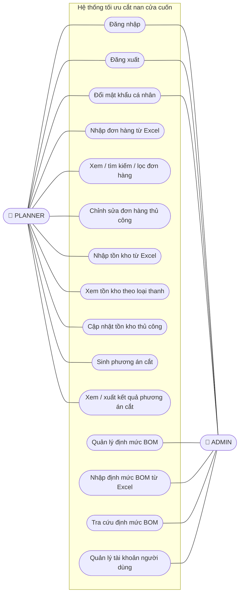

# 3.1.2 Biểu đồ ca sử dụng

*(Mermaid không có ký hiệu "người que" như công cụ vẽ UML chuyên dụng — actor được thay bằng node oval có nhãn 🧑; các đường nối là quan hệ association thông thường, không có mũi tên include/extend vì ở mức MVP các ca sử dụng của hệ thống chưa cần tách biệt include/extend.)*

## Ghi chú từng nhóm ca sử dụng

- **Tài khoản (dùng chung)**: điểm khởi đầu bắt buộc cho cả hai tác nhân trước khi tiếp cận bất kỳ chức năng nào khác; đăng nhập trả về JWT dùng cho các request tiếp theo.
- **Nhóm 1 — Đơn hàng & tồn kho** (chỉ PLANNER): nhập/xem/chỉnh sửa dữ liệu đầu vào của quy trình cắt.
- **Nhóm 3 — Sinh phương án cắt** (chỉ PLANNER): ca sử dụng lõi của khóa luận — "Sinh phương án cắt" kéo theo (include) việc sinh nhu cầu cắt từ BOM và chạy thuật toán 4 mức ưu tiên (xem chi tiết luồng trong `docs/sequence-diagrams.md`).
- **Nhóm 2 — Định mức BOM** (chỉ ADMIN): quản lý dữ liệu nền tảng ít thay đổi nhưng quyết định độ chính xác của nhu cầu cắt sinh ra.
- **Nhóm 4 — Tài khoản & phân quyền** (chỉ ADMIN): quản lý tài khoản PLANNER, gán vai trò.
